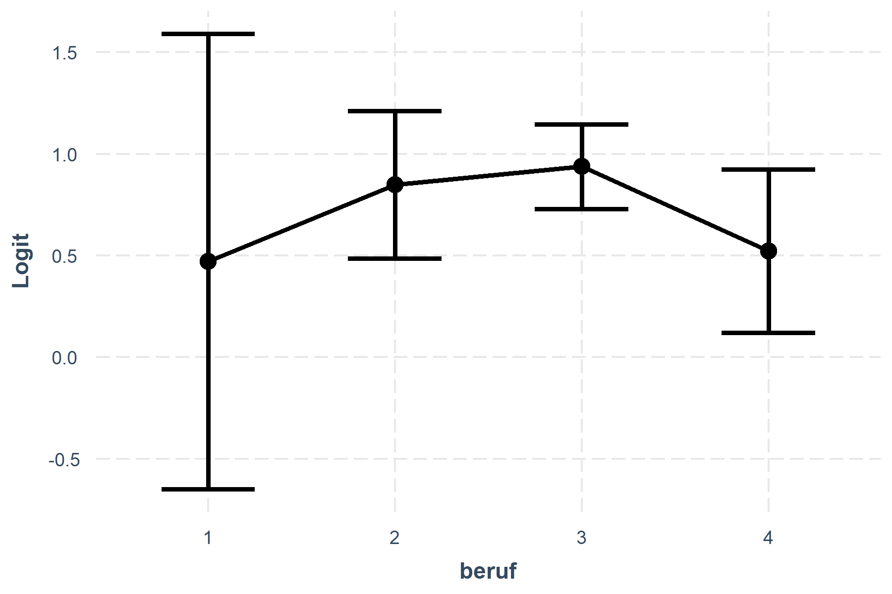
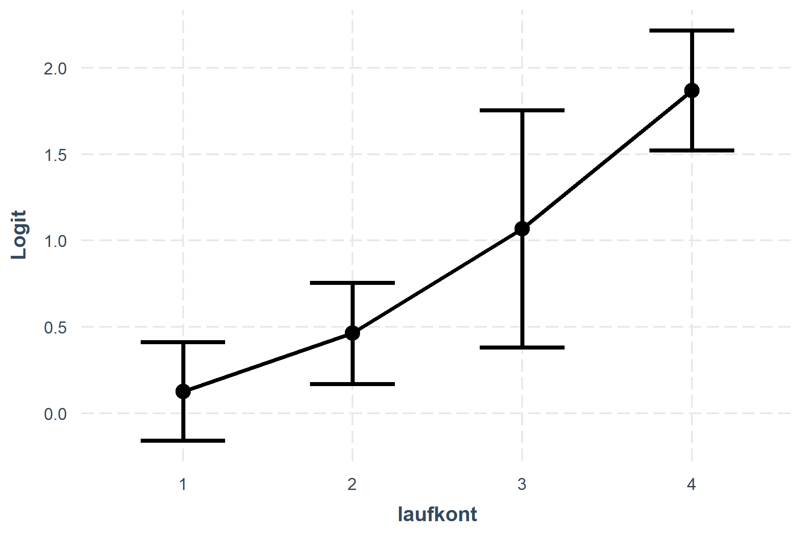
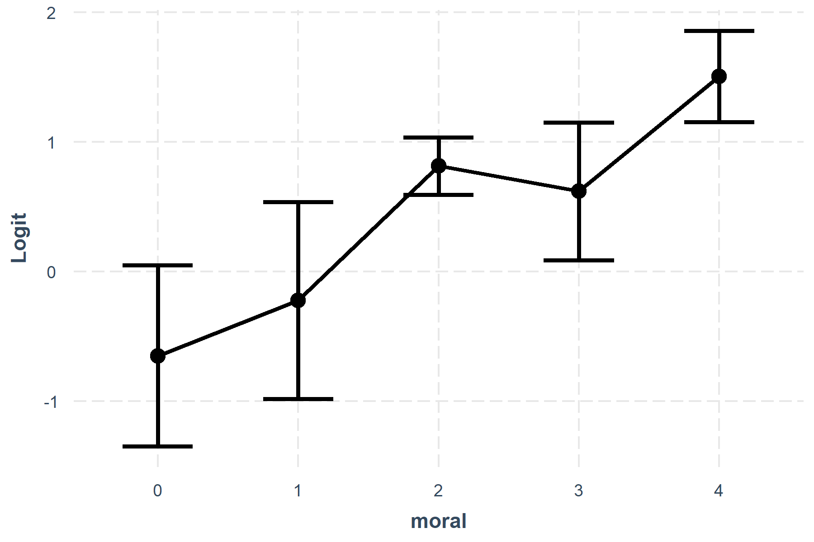
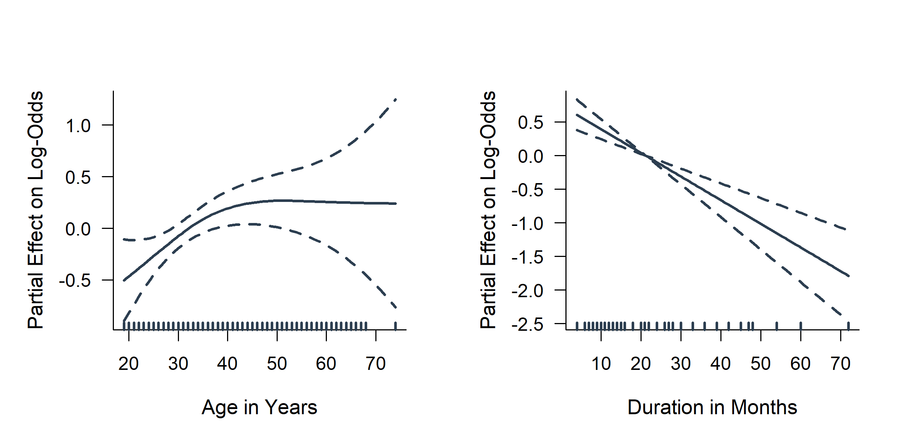
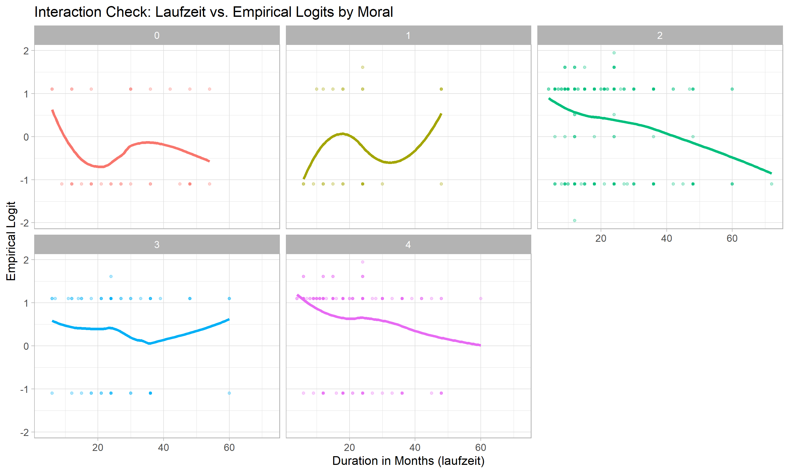
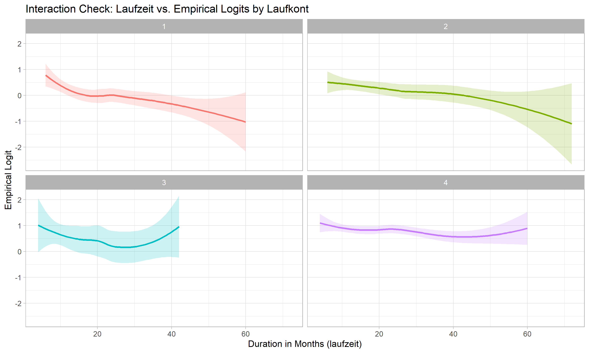
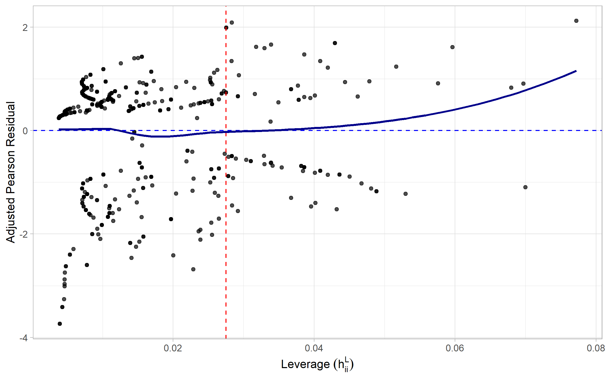

# Credit Risk Modeling and Classification

This project develops an interpretable logistic regression model for credit risk prediction. The model estimates borrower-specific probabilities of repayment and thereby supports credit-risk differentiation rather than relying solely on binary classification. The workflow combines binomial GLMs, functional-form assessment, likelihood-based model selection, residual and influence diagnostics, and out-of-sample validation.

### Data & Variable Definitions

The dataset contains 1,000 credit observations and is documented by the Ludwig-Maximilians-Universität München. The original variable definitions and category descriptions are provided in the [dataset documentation](https://data.ub.uni-muenchen.de/23/1/DETAILS.html).

The model uses the following predictors:

| Variable | Description | Type |
|---|---|---|
| `laufzeit` | Credit duration in months | Numeric |
| `moral` | Previous payment behavior | Categorical |
| `laufkont` | Existing current account status | Categorical |
| `alter` | Borrower age in years | Numeric |
| `beruf` | Occupation | Categorical |

The categorical variables show substantial differences in category frequencies:

| Variable | Category 0 | Category 1 | Category 2 | Category 3 | Category 4 |
| :--- | :--- | :--- | :--- | :--- | :--- |
| `moral` | 5.0% | 3.8% | 52.6% | 8.5% | 29.8% |
| `laufkont` | - | 27.1% | 27.0% | 6.1% | 39.6% |
| `beruf` | - | 1.8% | 20.0% | 63.5% | 14.6% |

The categorical predictors are unevenly distributed, with particularly sparse groups in `moral` and `beruf`. These differences in category frequency are considered when interpreting uncertainty and apparent deviations in the subsequent EDA.
The continuous predictors are summarized using basic descriptive statistics:

| Variable | Min | Median | Mean | SD | Max |
|:---------|----:|-------:|-----:|----:|----:|
| `laufzeit` | 4 | 18 | 20.9 | 12.1 | 72 |
| `alter` | 19 | 33 | 35.5 | 11.4 | 75 |

The target variable is:

| Variable | Description | Coding |
|---|---|---|
| `kredit` | Credit repayment status | `1` = correctly repaid, `0` = not correctly repaid |

Accordingly, `kredit = 1` represents the non-default class, while `kredit = 0` represents the default class throughout this project.

### Key Results

| Aspect | Result |
|---|---|
| Observations | 1,000 borrowers |
| Training profiles (aggregated)| 700 (654) |
| Selected predictors | `laufzeit`, `moral`, `laufkont` |
| Removed predictors | `beruf`, `alter` |
| Test AUC | 0.809 |
| Test Brier Score | 0.161 |
| Test Error Rate | 25.9% |

---

## Methodology

### Why Logistic Regression?
The choice of a standard binomial logistic regression is grounded in the structural properties of the response variable and the absence of overdispersion:

*   **Probability Constraints:** The dependent variable is binary. Standard linear regression cannot constrain predicted values to the $[0, 1]$ interval. The logit link function naturally maps the unbounded linear predictor $\eta_i \in \mathbb{R}$ to valid conditional probabilities.
*   **Interpretability (Canonical Link):** While other cumulative distribution functions (e.g., Probit or Complementary log-log) could restrict predictions to valid probabilities, the logit link is the canonical link for the binomial distribution. It uniquely allows coefficients to be exponentiated into odds ratios, which is crucial for transparent risk differentiation in credit portfolios.
*   **Algorithmic Stability (Concave Log-Likelihood):** The log-likelihood function of the binomial logistic regression model is strictly concave, provided the design matrix has full column rank. This mathematical property guarantees a unique global maximum during parameter estimation, which is essential for computationally robust risk scoring. A pre-estimation rank check of the full candidate design matrix confirmed full column rank ($rank = p = 13$), assuring the absence of perfect multicollinearity and guaranteeing the stability of the optimization algorithm.

### Data Aggregation
To prevent data leakage during model evaluation, identical covariate profiles within the training set are aggregated into grouped binomial observations:

$$Y_j \sim \text{Binomial}(n_j,\pi_j)$$

*   **$n_j$**: Number of borrowers sharing the identical covariate profile $j$.
*   **$Y_j$**: Observed number of proper loan repayments within profile $j$.
*   **$\pi_j$**: Profile-specific conditional probability of repayment.

Grouping binary responses into binomial counts is a mathematical prerequisite: it ensures the residual deviance and Pearson statistics follow an approximate $\chi^2$ distribution, which enables valid goodness-of-fit and overdispersion diagnostics.

### Mathematical Foundation
Let $\pi_j = P(\text{kredit}_j = 1 \mid \mathbf{x}_j)$ denote the conditional probability of proper repayment for a distinct covariate profile $j$. The model connects the linear predictor $\eta_j = \mathbf{x}_j^\top\boldsymbol{\beta}$ to this probability via the canonical logit link:

$$ \pi_j = \frac{1}{1+\exp(-\eta_j)} \iff \log\left(\frac{\pi_j}{1-\pi_j}\right) = \mathbf{x}_j^\top\boldsymbol{\beta} $$

This equivalence illustrates the dual structural of the chosen model: the left equation naturally bounds the predicted probabilities to the valid $(0, 1)$ interval, while the right equation guarantees a strict linear relationship between the predictors and the log-odds.

With the aggregated binomial data structure $Y_j \sim \text{Binomial}(n_j, \pi_j)$, the regression coefficients are estimated by maximizing the binomial log-likelihood:

$$ \ell(\boldsymbol{\beta}) = \sum_{j=1}^{J} \left[ Y_j \log(\pi_j) + (n_j - Y_j) \log(1 - \pi_j) \right] $$

---

## Exploratory Data Analysis & Functional Form Assessment
Before model selection, an exploratory analysis was conducted to assess category sparsity, functional forms of continuous predictors, and potential interaction effects.

#### Categorical Predictors
Univariate marginal-effect plots on the log-odds scale, derived from individual binomial GLM fits, were used to assess the functional relationships of the categorical predictors.
<p align="center">
  
  
  
</p>

**Figure:** Marginal effects of the categorical predictors. `laufkont` shows a clear, approximately linear upward trend, indicating higher repayment odds for better account statuses. `moral` exhibits an overall upward trend with minor non-monotonic deviations, while `beruf` shows no clear directional pattern.

Given the sparse representation of several categories, particularly `beruf` category 1, deviations at the boundaries should be interpreted cautiously as they are associated with substantially higher estimation uncertainty. The three regarded covariates are therefore specified as linear main effects.

#### Continuous Predictors

The functional form of the continuous predictors was assessed using Generalized Additive Models (GAMs) with smoothing splines. The non-parametric ANOVA test evaluates whether the flexible GAM provides significant evidence of deviation from a linear relationship. The reported `P(Chi)` is the corresponding p-value.

| Predictor      | GAM assessment                      | `P(Chi)` | Decision             |
| :------------- | :---------------------------------- | :------: | :------------------- |
| **`alter`**    | Mildly non-linear visual pattern    |   0.110  | Linear term retained |
| **`laufzeit`** | Approximately linear downward trend |   0.347  | Linear term retained |

<p align="center">
  
</p>

**Figure:** GAM smooths for `alter` and `laufzeit`. The estimated relationships do not provide statistically significant evidence for non-linearity.

With $\alpha = 0.05$, neither predictor shows statistically significant evidence of non-linearity. Both are therefore specified as linear main effects.

#### Interaction Diagnostics
Potential interactions were assessed using empirical logit plots with a continuity correction:

$$
\text{Empirical Logit}_i = \ln\left(\frac{y_i + 0.5}{n_i-y_i+0.5}\right)
$$

While non-parallel lines in such plots argue for the presence of interaction effects, they must always be considered together with their confidence bands to avoid misinterpreting random noise resulting from data sparsity.
To ensure a robust visual interpretation, asymptotic 95% confidence limits were derived using the standard normal quantile ($z_{\alpha/2}$).
The precision of each empirical logit depends on its asymptotic variance, calculated as:

$$
\widehat{Var}(\text{Empirical Logit}_i) = \frac{1}{y_i + 0.5} + \frac{1}{n_i - y_i + 0.5}
$$

These variances were used as inverse weights in a LOESS smoothing algorithm to generate the confidence bands for the continuous trend. To evaluate whether the continuous variable `laufzeit` interacts with the strongest categorical main effects (`moral` and `laufkont`), the empirical logits were plotted across their respective categories.

*1. Interaction Check: Laufzeit vs. Moral*
<p align="center">
  
</p>

* Categories 2 and 4 cover the vast majority of data (82.3%) and show roughly parallel downward trends with narrow confidence bands.
* Deviations in categories 0 (4.0%), 1 (4.9%), and 3 (8.8%) stem from data sparsity and high variance. This is visually confirmed by their wide confidence bands.
* Conclusion: The core population exhibits parallel trends and there is no strong evidence of non-parallelism in sparse groups. An additive main-effects framework is justified.

*2. Interaction Check: Laufzeit vs. Laufkont*
<p align="center">
  
</p>

* Categories 1 (27.4%), 2 (26.9%), and 4 (39.4%) are well-represented and exhibit a generally parallel downward trend.
*  Apparent deviations, such as the non-monotonic shape in the sparse category 3 (6.3%) or boundary fluctuations at higher durations, fall entirely within the wide 95% confidence bands.
* Conclusion: No systemic interaction pattern across main groups within the margins; an additive model prevents overfitting.

---

## Model Selection and Comparison

### AIC and BIC
Candidate variables are evaluated sequentially using both the Akaike Information Criterion (AIC) and the Bayesian Information Criterion (BIC). Both criteria balance model fit against complexity, with BIC applying a stricter penalty for the number of estimated parameters ($k$) based on the sample size ($n = 654$):

$$\text{AIC} = -2\ell(\hat{\boldsymbol{\beta}}) + 2k$$
$$\text{BIC} = -2\ell(\hat{\boldsymbol{\beta}}) + \ln(n)k$$

Both criteria unanimously selected the identical model:

$$\text{logit}(\pi_j) = \beta_0 + \beta_1\,\text{laufzeit}_j + \beta_2\,\text{moral}_j + \beta_3\,\text{laufkont}_j$$

Categorical predictors are represented using indicator variables relative to their reference categories. 

The candidate variables `beruf` and `alter` were excluded in both the AIC- and BIC-selected models, as their inclusion failed to improve the likelihood sufficiently to overcome either complexity penalty. This unanimous selection underscores the robustness of the retained predictors and their significant informational contribution to the model.

### Likelihood-Ratio Tests
Nested models are additionally compared using sequential likelihood-ratio tests (implemented via Analysis of Deviance). In the context of GLMs, the test statistic $G^2$ is exactly equivalent to the difference in residual deviances ($\Delta D$) between the reduced and the full model:

$$G^2 = D_{\text{reduced}} - D_{\text{full}} = 2\left[ \ell(\hat{\boldsymbol{\beta}}_{\text{full}}) - \ell(\hat{\boldsymbol{\beta}}_{\text{reduced}}) \right]$$

Evaluated against a $\chi^2$ distribution, these partial deviance tests formally confirm the sequential variable selection:

*   **Null vs. Baseline (`moral`):** Adding the baseline predictor `moral` provides a highly significant improvement over the intercept-only model ($p < 0.001$).
*   **Baseline vs. Main (`moral`, `laufkont`, `laufzeit`):** The variables selected by AIC and BIC provide a further, highly significant improvement to the model fit ($p < 0.001$).
*   **Marginal Additions (`alter`, `beruf`):** Adding either `alter` ($p = 0.248$) or `beruf` ($p = 0.758$) individually to the main model yields no significant reduction in residual deviance. This validates the decision of the AIC/BIC selection to exclude both predictors.
*   **Interaction Effects (`moral` $\times$ `laufzeit`, `laufkont` $\times$ `laufzeit`):** Adding the interaction term `moral` $\times$ `laufzeit` improves model fit significantly ($p = 0.024$), while adding the interaction term `laufkont` $\times$ `laufzeit` yields no significant reduction ($p = 0.727$).

#### Specification Decision
Finally, the Main model was compared against the model additionally containing the significant interaction term `moral` $\times$ `laufzeit`. Since `moral` has 5 categories and `laufzeit` is continuous, 4 additional interaction parameters ($5 - 1 = 4$) need to be estimated. A comparison of the models using BIC, which strictly penalizes model complexity, yields:

| Model | BIC |
|:---------|----:|
| Main | 770.92 | 
| Interaction | 785.63 |

The strict BIC penalty offsets the marginal deviance reduction of the interaction term. Therefore, the Main model without interaction effects is chosen to prevent overfitting. To sum up, the final model utilizes the following specification:

* `laufzeit` as a linear continuous predictor
* `moral` and `laufkont` as categorical predictors
* No non-linear transformations
* No interaction terms
---

## Model Diagnostics

### Functional Form Assessment
**Question:** Is the continuous predictor `laufzeit` adequately modeled as a linear main effect?

<p align="center">
  
</p>

*   **Method:** Partial residual analysis. Note that `laufzeit` is the only continuous covariate in the final specification, therefore its functional form can be isolated to check for non-linearity. The partial residuals are plotted against the predictor values $x_{ij}$. Algebraically, they are given as:

$$e_i^{Y|X_{-j}} := \frac{y_i - n_i\hat{p}_i}{n_i\hat{p}_i(1-\hat{p}_i)} + \hat{\beta}_j x_{ij}$$

*   **Evidence:** A LOESS smoothing curve applied to the partial residuals follows an approximately horizontal, straight path across the duration spectrum. 
*   **Interpretation:** The plot provides no evidence of systematic non-linearity. The linear approximation holds completely.
*   **Decision:** Retain `laufzeit` strictly as a linear predictor. No non-linear transformations are required.

### Goodness-of-Fit & Dispersion Check
**Question:** Does the model adequately describe the grouped data, and is the structural assumption of equidispersion satisfied?

**Method:** Residual deviance test and Pearson heterogeneity check. The residual deviance is evaluated against its asymptotic $\chi^2_{n-p}$ reference distribution. To assess potential overdispersion, the Pearson heterogeneity factor is calculated as: 

$$\frac{e_i^P}{\sqrt{1 - h_{ii}^L}}$$

**Evidence:** 
* **Global Fit:** Residual deviance = 693.85 on 645 degrees of freedom. This value is below the 95% critical threshold of 705.19, yielding a p-value of 0.089.
* **Dispersion:** The Pearson $\chi^2$ statistic is 647.12, resulting in an estimated dispersion parameter (heterogeneity factor) of $\hat{\sigma}^2 \approx 1.003$.

**Interpretation:** 
* The residual deviance does not provide statistically significant evidence of lack of fit at the 5% level.
* Aggregated binomial profiles can sometimes exhibit variance greater than the theoretical binomial variance $np(1-p)$ due to unobserved heterogeneity, which would necessitate mixed models such as Beta-Binomial regression[cite: 3]. However, the estimated heterogeneity factor ($\hat{\sigma}^2 \approx 1.003$) is exceedingly close to 1. This formally indicates that the observed variance matches the theoretical binomial variance perfectly, ruling out severe overdispersion.

**Decision:** Retain the standard Binomial GLM specification. There is no evidence of lack of fit, and the confirmed absence of overdispersion makes more complex mixed models unnecessary.

### Residual Structure & Link Function Assessment
**Question:** Are there systematic residual patterns indicating a misspecification of the link function or the linear predictors?

<p align="center">
  
</p>

*   **Method:** Residual analysis plotting residuals against fitted probabilities. While raw Pearson and deviance residuals evaluate general appropriateness, they structurally lack unit variances. To assess constant variance and prevent masking by high-leverage points, leverage-adjusted Pearson residuals are strictly required. They are given by the following formula:

$$e_i^a := e_i^P / \sqrt{1 - h_{ii}^L}$$

*   **Evidence:** The leverage-adjusted residuals fluctuate symmetrically around zero. The LOESS smoothing curve remains flat across the entire predicted probability spectrum, with only negligible boundary artifacts typical for non-parametric smoothing.
*   **Interpretation:** The absence of severe non-linear patterns (e.g., U-shapes) firmly confirms the structural appropriateness of the model. The constant variance across the stabilized residuals mathematically verifies the correct specification of the logit link function.
*   **Decision:** Retain the current model specification. No evidence of systematic lack of fit.

### Influence Diagnostics
**Question:** Do individual covariate profiles exert disproportionate influence on the estimated model parameters?

<p align="center">
  
  
</p>

*   **Method:** Leverage ($h_{ii}^L$) and Approximate Cook's Distance ($D_i^a$). Calculating the exact Cook's distance in logistic regression is computationally expensive as it requires iterative refitting. Therefore, the theoretically derived second-order Taylor expansion is computed manually as:

$$D_i^a := (e_i^P)^2 \frac{h_{ii}^L}{(1-h_{ii}^L)^2}$$
 
 This prevents the parameter-scaled ($p$) output typical for standard software functions and allows a direct evaluation against the absolute literature threshold of 1. Furthermore, a combined *Residuals vs. Leverage* plot is utilized to evaluate model fit and leverage simultaneously.
*   **Evidence:** The reference threshold for high leverage is mathematically defined as $2p/n$. While several observations exceed this boundary, their adjusted Pearson residuals remain within a moderate range. Consequently, all approximate Cook's distances stay well below the critical threshold of 1 (maximum $\approx$ 0.4).
*   **Interpretation:** Some aggregated profiles represent unusual predictor combinations, resulting in high leverage. However, since no observation exhibits simultaneously extreme leverage and an extreme residual, there are no highly influential data points distorting the model fit. The parameter estimates are robust.
*   **Decision:** Retain all observations.
---

## Validation & Risk Interpretation

### Out-of-Sample Performance
Stratification approximately preserves the class distribution across the training and test samples.

| Metric | Train | Test |
|---|---:|---:|
| AUC | 0.751 | 0.809 |
| Brier Score | 0.175 | 0.161 |
| Error Rate | 25.2% | 25.9% |

The similarity between training and test performance provides no pronounced evidence of overfitting on this hold-out sample.

### Discrimination
**Question:** Can the model distinguish higher-risk borrowers from lower-risk borrowers?


**Method:** ROC analysis and Area Under the Curve (AUC).

$$\text{AUC} = P(\hat p_{\text{repayment}} > \hat p_{\text{default}})$$

AUC measures how well the model distinguishes borrowers who repay their credit from borrowers who do not.

**Evidence:** The ROC curve lies above the random-classification benchmark, with an AUC of 0.811.

**Interpretation:** The model demonstrates good discrimination between repayment and default outcomes.

**Decision:** The model provides useful ranking information for risk differentiation.

### Probabilistic Accuracy
**Method:** Brier Score / MSE.

$$\text{BS} = \frac{1}{N} \sum_{i=1}^{N} (\hat p_i-y_i)^2$$

The Brier Score measures the mean squared error of probabilistic predictions, with lower values indicating better probabilistic accuracy. It complements the threshold-independent discrimination measure AUC.

### Risk Interpretation
Odds ratios are defined as:

$$\text{OR}_j = e^{\beta_j}$$

An odds ratio above 1 indicates higher odds of repayment for a one-unit increase in the predictor, holding all other variables constant. For categorical variables, the odds ratio is interpreted relative to the reference category.

**Key Predictor Impacts:**
*   **Laufzeit:** An odds ratio of 0.970 means that a one-month increase in duration multiplies the odds of repayment by 0.970, holding all other predictors constant.
*   **Moral:** The highest factor level (Category 4) has an odds ratio of 5.607 relative to the reference category, indicating substantially higher odds of repayment compared to the baseline moral category.
*   **Laufkont:** The highest factor level (Category 4) has an odds ratio of 5.510 relative to the reference category, indicating substantially higher odds of repayment compared to the baseline current account category.

The displayed probability threshold represents an operating point selected according to the ROC criterion ($J = \text{Sensitivity} + \text{Specificity} - 1$). In a production credit-risk setting, the final decision threshold would additionally depend on asymmetric misclassification costs, risk appetite, and regulatory requirements.

---

## Limitations & Extensions

* Model Specification: The final model relies on a parsimonious additive framework. While key interactions were evaluated visually, exhaustive algorithmic screening of higher-order terms was omitted to prevent overfitting.
* Validation Strategy: Out-of-sample evaluation is based on a single hold-out split rather than repeated cross-validation.
* Decision Thresholds: No explicit cost-sensitive threshold optimization was applied for the classification cut-off.

Natural extensions include implementing k-fold cross-validation, probability calibration, and asymmetric cost matrices to optimize decision thresholds.

---

## Repository Structure

```text
.
├── data/
│   └── credit.txt                              (Raw dataset)
├── output/
│   ├── figures/                                
│   │   ├── cooks_distance.png                  (Cook's distance analysis)
│   │   ├── gam_alter.png                       (GAM smooth term for age)
│   │   ├── gam_laufzeit.png                    (GAM smooth term for duration)
│   │   ├── leverage_plot.png                   (Leverage analysis)
│   │   ├── partial_residual_laufzeit.png       (Linearity check for duration)
│   │   ├── residuals_adjusted.png              (Adjusted Pearson residuals)
│   │   ├── residuals_deviance.png              (Deviance residuals)
│   │   └── residuals_pearson.png               (Pearson residuals)
│   ├── performance/                        
│   │   ├── classification_metrics.csv          (Test vs. Train risk metrics)
│   │   ├── confusion_matrix.csv                (Absolute prediction counts)
│   │   └── roc_curve.png                       (High-res ROC visualization)
│   ├── tables/                                 
│   │   ├── goodness_of_fit.csv                 (Residual deviance GoF test)
│   │   ├── model_comparison_aic.csv            (AIC stepwise selection steps)
│   │   └── odds_ratios.csv                     (Model coefficients and ORs)
│   ├── credit_agg.rds                          (Saved aggregated training dataset)
│   ├── data_test.rds                           (Saved hold-out test split)
│   ├── data_train.rds                          (Saved training split)
│   └── model_main.rds                          (Saved final GLM object)
├── script/
│   ├── 01_data_prep_and_selection.R            (Split, aggregation, and stepwise AIC selection)
│   ├── 02_model_diagnostics.R                  (Residual analysis and influence metrics)
│   └── 03_model_performance.R                  (Out-of-sample hold-out and ROC/Brier evaluation)
├── credit-risk-modeling.Rproj                  (RStudio project file)
└── README.md                                   (Project documentation)
