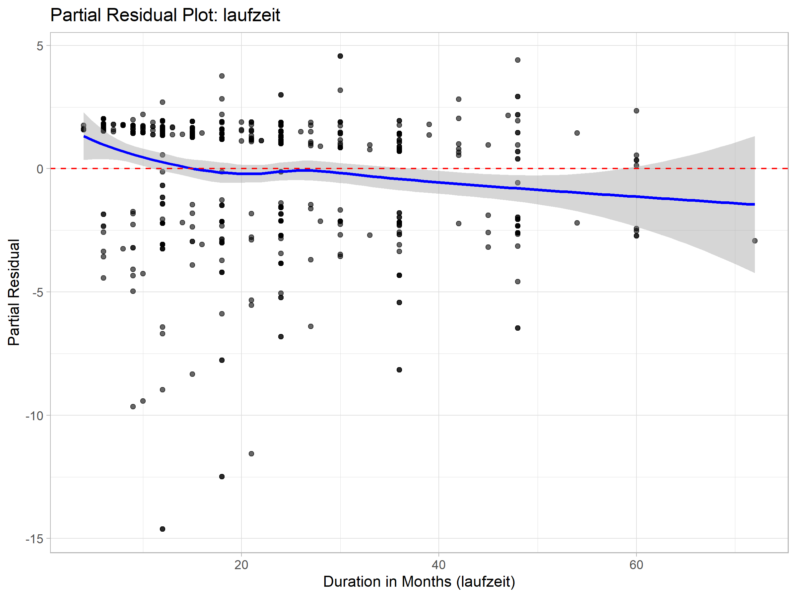
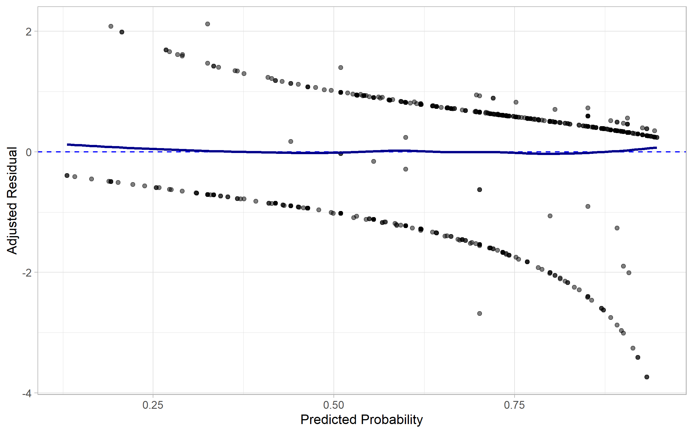
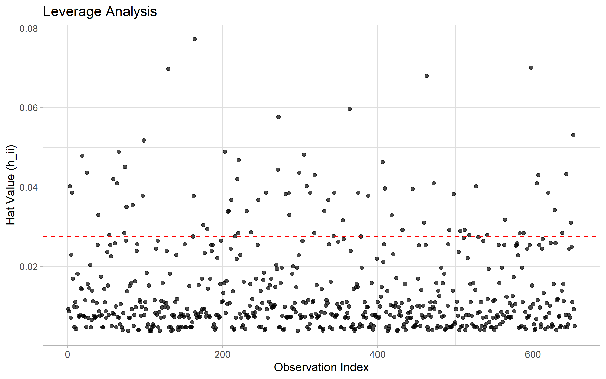
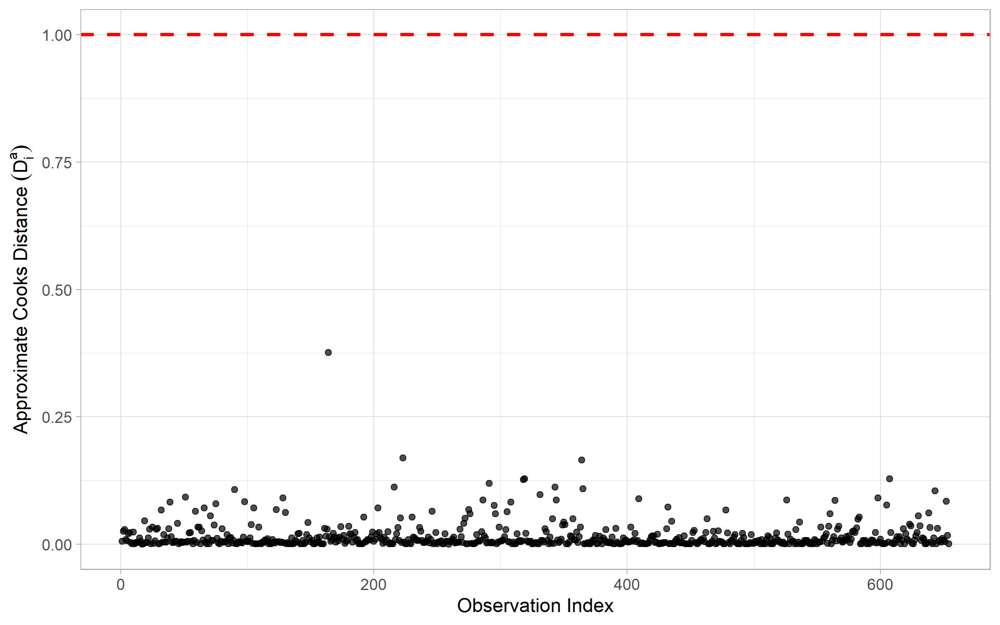
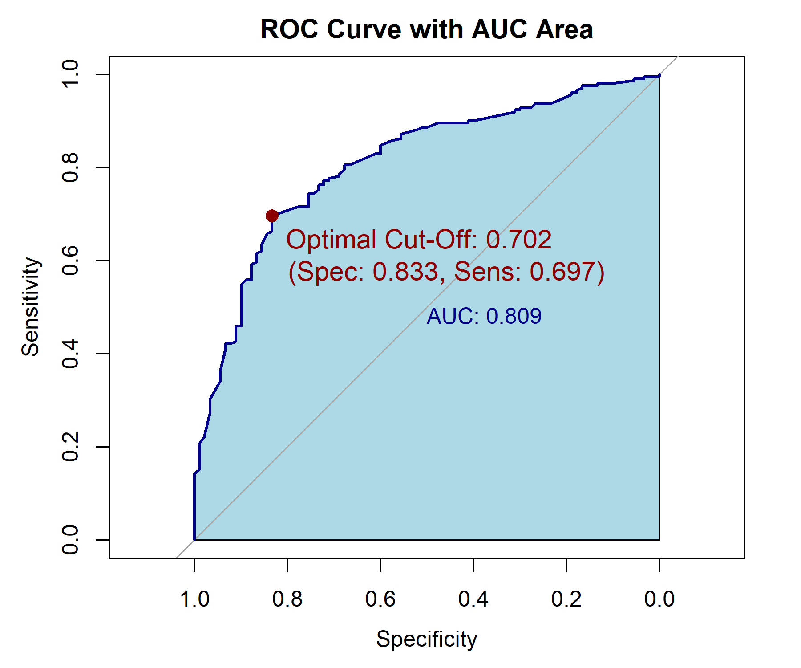

# Credit Risk Modeling and Classification

This project develops an interpretable logistic regression model for credit default prediction. The model estimates borrower-specific probabilities of default rather than relying solely on binary classification. The workflow combines binomial GLMs, functional-form assessment, likelihood-based model selection, residual and influence diagnostics, and out-of-sample validation.

## Key Results

| Aspect | Result |
|---|---|
| Observations | 1,000 borrowers |
| Aggregated profiles | 912 |
| Selected predictors | laufzeit, moral, laufkont, alter |
| Removed predictor | beruf |
| Test split | 70/30 stratified hold-out |
| Test AUC | 0.811 |
| Test MSE | 0.160 |
| Test Error Rate | 25.3% |

---

## Methodology

### Why Logistic Regression?
Logistic regression was chosen because it combines probabilistic prediction with direct coefficient and odds-ratio interpretation, making it particularly suitable for an interpretable credit-risk setting.

### Data Aggregation
Identical covariate profiles are aggregated into grouped binomial observations:

$$Y_j \sim \text{Binomial}(n_j,\pi_j)$$

where $n_j$ is the number of borrowers in profile $j$, $Y_j$ is the observed number of defaults, and $\pi_j$ is the profile-specific probability of default.

The aggregation preserves the binomial likelihood while enabling grouped residual and goodness-of-fit diagnostics.

### Mathematical Foundation
The linear predictor $\eta_i = \mathbf{x}_i^\top\boldsymbol{\beta}$ is mapped to the default probability via the inverse logit function:

$$\pi_i = \frac{1}{1+\exp(-\eta_i)}$$

Equivalently, the model estimates log-odds:

$$\log\left(\frac{\pi_i}{1-\pi_i}\right) = \mathbf{x}_i^\top\boldsymbol{\beta}$$

Coefficients are estimated by maximum likelihood:

$$\ell(\boldsymbol{\beta}) = \sum_{i=1}^{n} \left[ y_i\log(\pi_i) + (1-y_i)\log(1-\pi_i) \right]$$

### Model Selection
Additional candidate variables are evaluated sequentially. AIC balances model fit against model complexity by penalizing the number of estimated parameters:

$$\text{AIC} = -2\ell(\hat{\boldsymbol{\beta}}) + 2k$$

The selected model is:

$$\text{logit}(\pi_i) = \beta_0 + \beta_1\,\text{laufzeit}_i + \beta_2\,\text{moral}_i + \beta_3\,\text{laufkont}_i + \beta_4\,\text{alter}_i$$

Categorical predictors are represented using indicator variables relative to their reference categories.

The variable `beruf` was excluded because its inclusion did not reduce AIC sufficiently to justify the additional parameters.

### Model Comparison
Nested models are additionally compared using likelihood-ratio tests:

$$G^2 = 2\left[ \ell(\hat{\boldsymbol{\beta}}_{full}) - \ell(\hat{\boldsymbol{\beta}}_{reduced}) \right]$$

Likelihood-ratio tests assess whether additional predictors significantly improve model fit, while AIC provides the complementary complexity-adjusted selection criterion.

---

## Model Diagnostics

### Functional Form
**Question:** Is `laufzeit` adequately modeled as a linear predictor?



**Method:** Partial residual analysis with LOESS.

**Evidence:** No pronounced systematic curvature is visible.

**Interpretation:** The plot provides no strong graphical evidence of systematic nonlinearity in the effect of `laufzeit` on the logit scale.

**Decision:** Retain `laufzeit` as a linear predictor.

### Goodness-of-Fit
**Question:** Does the model adequately describe the grouped data?

**Method:** Residual deviance test.

**Evidence:** The residual deviance is compared with its asymptotic $\chi^2_{df}$ reference distribution.

**Result:** Residual deviance = 948.9, df = 902, p = 0.135.

**Interpretation:** The residual deviance does not provide statistically significant evidence of lack of fit at the 5% level.

**Decision:** No evidence of lack of fit; retain the specification.

### Residual Structure
**Question:** Are there systematic residual patterns indicating model misspecification?



**Method:** Leverage-adjusted Pearson residuals.

**Evidence:** Residuals fluctuate around zero without pronounced systematic patterns or clusters of extreme observations.

**Interpretation:** The residual structure provides no obvious evidence of systematic misspecification.

**Decision:** No evidence requiring a change in model specification.

### Influence Diagnostics
**Question:** Do individual covariate profiles exert disproportionate influence on the fitted model?





**Method:** Leverage and Cook's Distance.

**Evidence:** Some profiles exceed the leverage reference threshold $2p/n$, while Cook's distances remain small.

**Interpretation:** Some profiles represent unusual predictor combinations, but none appears to exert disproportionate influence on the fitted coefficients.

**Decision:** Retain all observations.

---

## Validation & Risk Interpretation

### Out-of-Sample Performance
Stratification approximately preserves the class distribution across the training and test samples.

| Metric | Train | Test |
|---|---:|---:|
| AUC | 0.753 | 0.811 |
| Brier Score | 0.175 | 0.160 |
| Error Rate | 25.6% | 25.3% |

The similarity between training and test performance provides no pronounced evidence of overfitting on this hold-out sample.

### Discrimination
**Question:** Can the model distinguish higher-risk borrowers from lower-risk borrowers?



**Method:** ROC analysis and Area Under the Curve (AUC).

$$\text{AUC} = P(\hat p_{\text{default}} > \hat p_{\text{non-default}})$$

AUC measures how well the model ranks risky borrowers above non-risky borrowers.

**Evidence:** The ROC curve lies above the random-classification benchmark, with an AUC of 0.811.

**Interpretation:** The model demonstrates good discrimination between default and non-default observations.

**Decision:** The model provides useful ranking information for risk differentiation.

### Probabilistic Accuracy
**Method:** Brier Score.

$$\text{BS} = \frac{1}{N} \sum_{i=1}^{N} (\hat p_i-y_i)^2$$

The Brier Score measures the mean squared error of probabilistic predictions, with lower values indicating better probabilistic accuracy. It complements the threshold-independent discrimination measure AUC.

### Risk Interpretation
Odds ratios are defined as:

$$\text{OR}_j = e^{\beta_j}$$

An odds ratio above 1 indicates higher odds of default for a one-unit increase in the predictor, holding all other variables constant. For categorical variables, the odds ratio is interpreted relative to the reference category.

**Key Predictor Impacts:**
*   **Laufzeit:** An odds ratio of 0.966 means that a one-month increase in duration multiplies the odds of default by 0.966, holding all other predictors constant.
*   **Moral:** Category 4 has an odds ratio of 4.601 relative to the reference category, indicating substantially higher odds of default compared to the baseline moral category.
*   **Alter:** An odds ratio of 1.013 means that a one-year increase in age multiplies the odds of default by 1.013, holding all other predictors constant.

The displayed probability threshold represents a statistically optimized operating point based on the ROC criterion ($J = \text{Sensitivity} + \text{Specificity} - 1$). In a production credit-risk environment, the final decision threshold should additionally reflect asymmetric misclassification costs, risk appetite, and regulatory constraints.

---

## Limitations & Extensions

*   Model selection is currently performed before the train/test split. A fully leakage-resistant workflow would perform model selection exclusively within the training sample, with the test set used only for final evaluation.
*   Single hold-out split (no repeated cross-validation).
*   No temporal validation.
*   No explicit cost-sensitive threshold optimization.

Natural extensions include nested model selection, probabilistic accuracy analysis, interaction effects, nonlinear terms, and cost-sensitive decision thresholds.

---

## Repository Structure

```text
.
├── data/credit.txt                     (Raw dataset)
├── output/
│   ├── figures/                        (Diagnostic plots)
│   ├── tables/                         (Parameter and GoF tables)
│   └── performance/                    (Validation metrics and ROC)
├── 01_data_prep_and_selection.R        (Aggregation and stepwise AIC selection)
├── 02_model_diagnostics.R              (Residual analysis and influence metrics)
├── 03_model_performance.R              (Stratified hold-out and ROC/Brier evaluation)
└── README.md                           (Project documentation)
