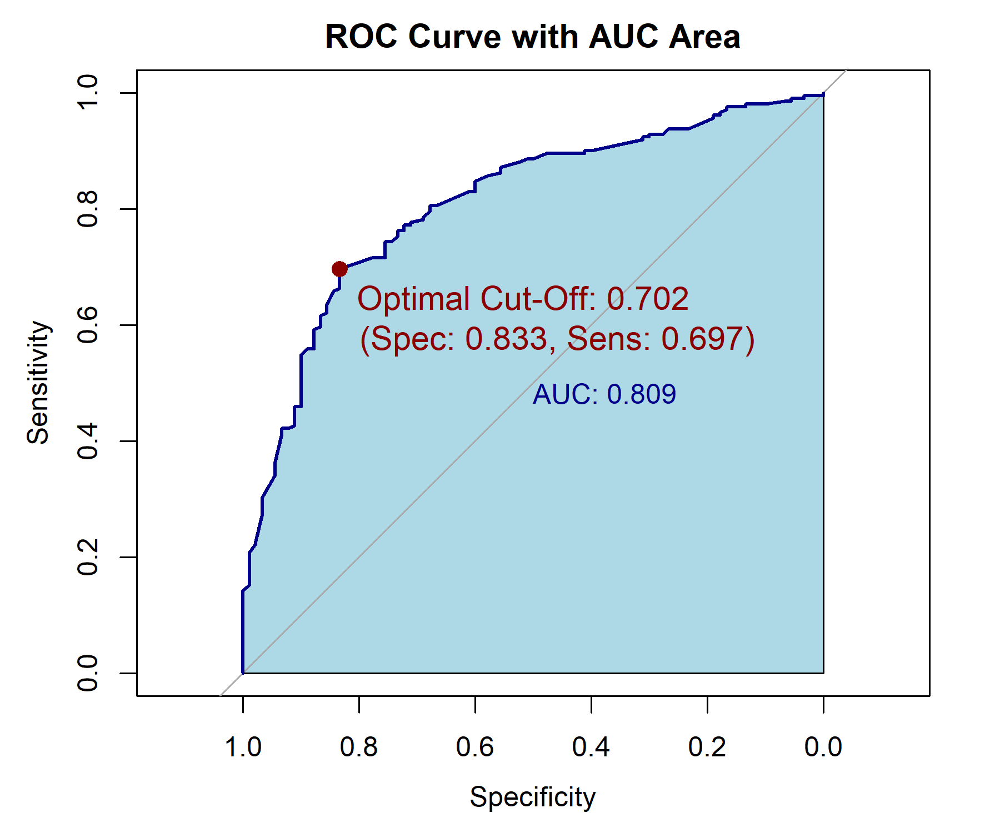

# Credit Default Modeling and Classification

This project develops a logistic regression model for credit default prediction with respect to consumer credits. An iterative EDA is performed to access the statistical noise influencing the data and builds the basis for the model selection. For the interpretation of model business implications, an average interest rate as well as a loss of capital quote is used to estimate a threshold for rejecting a loan by taking the asymmetric costs into account.

### Data & Variable Definitions

The dataset contains 1,000 credit observations and is documented by the LMU ( [See dataset documentation](https://data.ub.uni-muenchen.de/23/1/DETAILS.html)).
The following predictors are considered:

 Variable | Description | Type |
| :--- | :--- | :--- |
| `laufzeit` | Credit duration in months | Numeric |
| `dlaufzeit` | Expert-discretized credit duration | Categorical (Ordinal) |
| `moral` | Previous payment behavior | Categorical (Ordinal) |
| `laufkont` | Existing current account status | Categorical (Ordinal) |
| `alter` | Borrower age in years | Numeric |
| `dalter` | Expert-discretized borrower age | Categorical (Ordinal) |
| `beruf` | Occupation | Categorical (Ordinal) |

The continuous variables age and credit duration (`dalter`, `dlaufzeit`) ocure binned in the data documentation.


The observations are split into 700 training data, with 654 unique covariate profiles, and 300 test data. For the training data, categorical variables show differences in category frequencies:


| Variable | Category 0 | Category 1 | Category 2 | Category 3 | Category 4 |
| :--- | :--- | :--- | :--- | :--- | :--- |
| `moral` | 5.0% | 3.8% | 52.6% | 8.5% | 29.8% |
| `laufkont` | - | 27.1% | 27.0% | 6.1% | 39.6% |
| `beruf` | - | 1.8% | 20.0% | 63.5% | 14.6% |


The continuous predictors with respect to the training data are summarized using basic descriptive statistics:

| Variable | Min | Median | Mean | SD | Max |
|:---------|----:|-------:|-----:|----:|----:|
| `laufzeit` | 4 | 18 | 20.9 | 12.1 | 72 |
| `alter` | 19 | 33 | 35.4 | 11.3 | 74 |

The binary response variable is defined as:

| Variable | Description | Coding |
|---|---|---|
| `kredit` | Credit repayment status | `1` = repayment, `0` = default |


### Key Results <need to be adjusted>


| Aspect | Result |
|---|---|
| Observations | 1,000 borrowers |
| Training profiles (aggregated)| 700 (654) |
| Selected predictors | `laufzeit`, `moral`, `laufkont` |
| Removed predictors | `beruf`, `alter` |
| Test AUC | 0.809 |
| Test Brier Score | 0.161 |
| Test Error Rate | 25.9% |

---

## Methodology

### Why Logistic Regression?
The response is binary distributed, therefore the model has to predict labels in $\{0, 1\}$. Moreover:

*   **Flexible Threshold:** The link function maps the unbounded linear predictor $\eta_i \in \mathbb{R}$ to conditional probabilities allowing the use of a threshold that can be optimized to the underlying business structure.
*   **Interpretability:** Using the logit link allows the interpretation of odds ratios for an intuitive risk differentiation with respect to categorical predictors.
*   **Algorithmic Stability:** The log-likelihood function of the binomial logistic regression model is strictly concave, provided the design matrix has full column rank. This property guarantees a unique global maximum, which results in more robust computation in the iterated least squares algorithm for parameter estimation, since the theoretical existence of the regression parameters is guaranteed.

### Data Aggregation
Identical covariate profiles within the training set are aggregated into $J$ grouped binomial observations:

$$Y_j \sim \text{Binomial}(n_j,\pi_j)$$

*   **$n_j$**: Number of borrowers sharing the identical covariate profile $j$.
*   **$Y_j$**: Observed number of proper loan repayments within profile $j$.
*   **$\pi_j$**: Profile-specific conditional probability of repayment.

This has the advantage that the residual deviance and Pearson statistics follow an approximate $\chi^2$ distribution under the assumption of correct model specification, since the number of parameters is fixed relative to the sample size.
Otherwise, residual deviance could not be used to evaluated goodness of fit.

### Mathematical Foundation
Let $\pi_j = P(\text{kredit}_j = 1 \mid \mathbf{x}_j)$ be the conditional probability of a repayment for the covariate profile $j$. Then, for the linear predictor $\eta_j = \mathbf{x}_j^\top\boldsymbol{\beta}$ holds:

$$ \pi_j = \pi(\mathbf{x}_j) = \frac{1}{1+\exp(-\eta_j)} \iff \log\left(\frac{\pi_j}{1-\pi_j}\right) = \eta_j $$

The left equation bounds the predicted probabilities to the $(0, 1)$ interval. The right equation connects the linear predictor $\eta_j$ to the theoretical mean of the underlying profile $j$ via the canonical logit link function.

With the aggregated binomial data structure $Y_j \sim \text{Binomial}(n_j, \pi_j)$, the regression coefficients are estimated by maximizing the binomial log-likelihood:

$$ \ell(\boldsymbol{\beta}) = \sum_{j=1}^{J} \left[ Y_j \log(\pi_j) + (n_j - Y_j) \log(1 - \pi_j) \right] $$

This term differs from the binary log-likelihood for the success probabilities only by a constant, hence maximizing both is equivalent.
The underlying design matrix has full rank ($=26 = p$),hence the log-likelihood of the binomial response attains an unique maximum resulting in algorithmic stability.

---

## Exploratory Data Analysis
First, an exploratory analysis is conducted to differentiate the risk profiles by considering the empirical logits within their approximated confidence intervals. Moreover, interaction effects are regarded. Last, functional form checks for the continuous covariates are performed.
This section builds the foundation for developing hypothesis for data trends by taking statistical noise into account.

### Categorical Predictors

For the categorical features, there exist no empty categories, but sparse ones ($< 5 % $ of data records). Moreover, categories are listed that contain a low amount of defaults or repayments ($ < 1 % $ of data records):

*   `moral`: level 1 contains approx. $3.8\%$
*   `beruf`: level 1 contains approx. $1.9\%$ ($< 1\%$ defaults or repayments)
*   `dalter`: age groups $>60$, i.e., `60-64` and `$ > 65$` contain in total approx. $5.4\%$ (both bins contain $< 1\%$ defaults or repayments)
*   `dlaufzeit`: durations $>36$ months are fragmented - the range `49-54` contains approx. $0.3\%$ and `37-42` and `>54` contain in total $2.7\%$ (bins `37-42`, `49-54` and `>54` contain $< 1\%$ defaults or repayments)

#### Marginal effects 
 For a covariate with $K$ categories, the empirical logit for category $k \in \{1: K\}$ containing $n_k$ observations and $y_k$ repayments is defined by:

$$
\text{Empirical Logit}_k = \ln\left(\frac{y_k}{n_k-y_k}\right)
$$

The squared standard error of the k$^{\text{th}}$ empirical logit is defined by

$$
\text{SE}(\text{Empirical Logit}_k)^2 = \frac{1}{y_k} + \frac{1}{n_k - y_k}.
$$

No covariate exhibits a category containing only default or repayment observations, thus no continuity correction is required.
By data sparsity, the above mentioned bins for `dlaufzeit`, `dalter` and `beruf`contain fewer than $1 \%$ of all observations as defaults or repayments resulting in wide Confidence Intervals (CIs).

The approximate CIs are derived via the Delta method and constructed as:

$$
\text{Empirical Logit}_k \pm z_{0.975} \cdot \text{SE}(\text{Empirical Logit}_k),
$$

where $z_{0.975}$ denotes the $97.5^\text{th}$ percentile of the standard normal distribution.

In the following the empirical logits for the categorical variables together with their approximate confidence intervals (CIs) are plotted to visually assess its influence on the response.
This impact measured by the largest logit-delta:
Let $o_k = \frac{\pi_k}{1 - \pi_k}$ be the k$^{\text{th}}$ odds of success, which displays the ratio between repayment and default of category $k$ for a fixed covariate. Via the unbiased estimator $\hat{\pi}_k = \frac{y_k}{n_k}$ for the k$^{\text{th}}$ success probability holds $\ln(o_k) = \text{Empirical Logit}_k$. Thus, the logit-deltas for categories $k$ and $j$ are given by:

$$
\text{Empirical Logit}_j - \text{Empirical Logit}_k = \ln\left(\frac{o_j}{o_k}\right)
$$

Consequently, a large maximum logit-delta indicates fluctuations in the repayment-to-default odds across categories, whereas a near-zero delta indicates homogeneous risk profiles. Note, only estimators of the empirical logits are available, hence this is only threaten as visual diagnostic tool.


Detailed tabular summaries including bin sizes and approximate CIs are exported to 
[`output/tables/eda_empirical_logits_summary.csv`](output/tables/eda_empirical_logits_summary.csv). For the detailed comparison between the merged and unmerged version of `dlaufzeit`, `dalter` and `beruf`, see [`output/tables/eda_empirical_logits_comparison.csv`](output/tables/eda_empirical_logits_comparison.csv).


###### Duration: raw vs merged

<p align="center">
  
</p>

**Figure:** Logit extremes yielding delta of $2.23$ in both plots (ranging from $1.87$ in bin $\le 6$ to $-0.36$ in bin $43-48$). For `dlaufzeit`, due to data sparsity in range of $>36$ months, there are structural breaks in the downward trend (e.g., spike to $2.08$ at $37-42$ months bin). Maximum CI width in category $49-54$ is approximately $5.54$ (L: $-2.77$, U: $2.77$, $n = 2$) and absorbs the CIs of bins $43-48$ and $> 54$. These categories exhibit similar empirical logits with overlapping CIs and thus an analogous effect on the response, which is why the categories $> 36$ are merged. The plot for `dlaufzeit_merged` shows in the right tail (aggregation of the four sparse categories, $n = 60$, empirical logit $= 0$) a stabilization in the CI width of $1.02$ (L: $-0.51$, U: $0.51$) and overall trend.


Both plots show an overall downward trend indicating that in total, the default risk rises with higher loan duration. 

Note: The empirical logit of bin $19-24$ does not provide a structural break in both plots, since its CI is nearly absorbed by the CIs of its neighboring categories. In particular for `dlaufzeit`, the bins $37-42$, $49-54$ and $>54$ are sparse, each consisting of $<1.5\%$ of the data records resulting in pairwise absorbing / highly overlapping CIs and thus they do not provide a structural break as well.


###### Repayment history
<p align="center">
  
</p>

**Figure:** Marginal effect size delta of $2.15$ (extremes: level $4$: $1.50$ vs. level $0$: $-0.65$), with extremes in level $4$ and level $0$, exhibiting no CI overlap. Maximum CI width of $1.52$ (L: $-0.98$, U: $0.54$, $n = 27$) due to data sparsity is given in category $1$.

The plot shows overall a monotonic increasing trend between extreme categories $0$ (hesitant) and $4$ (clean), indicating that positive payment history rises the empirical repayment probability. The CIs of category $1$ and $2$ are disjoint and its empirical logits showing the highest increase between all categories, visually representing a distinction of the empirical repayment probability between consumers with negative and positive credit history. 

Note: The empirical logit of category $3$ is less than the one of category $2$. Since its CI absorbs the one of bin $2$, this does not provide a structural break and is explained by statistical noise due to a low amount of data records. Moreover, `moral` captures crucial qualitative risk categories. Despite similar effects on the response across bins $0, 1$ and $2, 3$,  merging them could eliminate critical risk differentiation.


###### Bankaccount status
<p align="center">
  
</p>

**Figure:** Marginal effect size delta of $1.74$ (extremes: level $4$: $1.87$ vs. level $1$: $0.13$), with extremes in level $4$ and level $1$, exhibiting no CI overlap. Bin $3$ shows a CI width $>1.30$ (L: $0.38$, U: $1.76$, $n = 43$) due to moderate data sparsity resulting in higher estimated variance.

The plot overall shows a monotonic upward trend with no structural breaks, indicating that an existing and covered bank account (bin $4$) increases the empirical repayment probability. All neighboring CIs are significantly overlapping, providing no clear distinction between adjacent categories. Nevertheless, the extremes visually separate high and low risk profile.


##### 2. Secondary Risk Driver (Moderate Delta, Structural Non-Linearity):
###### Age: raw vs merged
<p align="center">
  
</p>

**Figure:** The marginal effect size delta is about $0.94$ (extremes: $1.28$ in bin $60-64$ vs. $0.34$ in bin $\le 25$). These categories show a substantial CI overlap. Bins $60-64$ ($3.3\%$) and $\ge 65$ ($2.1\%$) exhibit CI widths $>1.75$ (maximum CI width in category $\ge 65$ is $2.14$, L: $-0.38$, U: $1.76$, $n = 15$) due to high estimation variance caused by data sparsity. Despite the aggregation, the plot for `dalter_merged` shows high estimated variance in the right tail (aggregation of the two sparse upper categories, $n = 38$, empirical logit of $1.03$, and CI width of $1.44$, L: $0.31$, U: $1.75$), since the CI absorbs the CIs of bins $26-39$ and $40-59$ and strongly overlaps with the CI of category $\le 25$.

The plots for `dalter` and `dalter_merged` exhibit a concave, approximately quadratic structure. The categories $\le 25$ and $26-39$ have nearly distinct CIs and provide the only significant steep increase in empirical logits, visually indicating a distinction of the repayment rate between very low age groups and all others. This provides a higher baseline risk for very young borrowers, whereas the empirical repayment rate stabilizes and plateaus across all other age bins.

##### 3. Weak Risk Driver (Low Delta, Severe CI Overlap):
###### Occupation: raw vs merged
<p align="center">
  
</p>

**Figure:** Marginal effect size delta for the merged plot is about $0.42$ (extremes: level $3$: $0.94$ vs. level $4$: $0.52$), adjusted from a delta of $0.47$ (extremes: level $3$: $0.94$ vs. level $1$: $0.47$) from the raw plot. The CI of category $1$ (CI width $> 2.00$, L: $-0.65$, U: $1.59$, $n = 13$) absorbs the CIs of all categories in the plot regarding `beruf`, caused by data sparsity. Merging categories $1$ and $2$ is valid, since both represent households with the lowest income and qualification level, only differing in having a permanent residence. This aggregation weakened the masking effect of the level $1$ bin and reduced the maximum CI width to $0.68$ (level $1\_2$, L: $0.47$, U: $1.15$, $n = 153$). 

Despite the data aggregation, CI overlaps persist across all levels, indicating a weak predictive effect on the response and providing no significant risk distinction across the categories.
 
#### Interaction effects
In the following the combined empirical logit plots for non-parallel trends are visually screened to detect possible interaction terms. Instead of regarding all combinations, the strongest main effects driven by hypotheses are analyzed. The empirical logits and their approximate CIs are calculated analogously as for the marginal effects - but with a continuity correction of $\frac{1}{2}$, since there exist cell-combinations without repayments or defaults. For sparse cells, this correction can influence the slopes of the linear interpolations between the logits. Moreover, only estimates of the logits are available, thus these plots should be threaten as first diagnostic hint.


Detailed tabular summaries including bin sizes and approximate CIs are exported to 
[`output/tables/eda_interaction_summary.csv`](output/tables/eda_interaction_summary.csv). For the detailed comparison between the merged and unmerged interaction plots, see [`output/tables/eda_interaction_comparison.csv`](output/tables/eda_empirical_logits_comparison.csv).

##### Laufzeit vs. Moral
The longer a loan runs (higher maturity), the higher the underlying risk of unforeseen life events (unemployment, illness).
Does an excellent credit history (moral = 4) provide better protection against this long-term risk than a critical history (moral = 0)?

<p align="center">
  
</p>

**Figure:** All duration bins exhibit broadly parallel trajectories. In the raw plot, line intersections (e.g., `moral` 0 crossing `moral` 3 at $37-42$ months) are driven by sparse cells ($n = 1$) with near-complete CI overlap. Visual deviations, such as the steep drop of `moral` 1 at $25-30$ months, are masked by CI widths $> 6.00$ logits (L: $-4.30$, U: $2.10$, $n = 1$). Similarly, the spike of `moral` 3 at $43-48$ months corresponds to a CI width $> 5.00$ logits (L: $-1.01$, U: $4.91$, $n = 1$). Data sparsity in duration bins $>36$ months yields overlapping CIs $> 4.00$ logits across categories. In the merged version, all duration bins maintain a nearly parallel trend. Deviations and line intersections in the right tail were weakened by the $>36$ aggregate, which reduced the maximum CI width in this aggregated bin to $3.82$ logits for `moral` 1 (L: $-1.06$, U: $2.76$, $n = 4$). Remaining line intersections are driven by 2D combinatorial cell sparsity with near-complete CI overlap, indicating high uncertainty. 

Across both plots, non-parallelism is indistinguishable from estimation variance, providing no robust visual evidence for an interaction effect.


##### Laufzeit vs. Laufkont
Account status proxies liquidity; duration defines time-at-risk.
Does high liquidity offset the risk of long-term loans, or do poor accounts amplify default risk over long durations (e.g., due to debt consolidation)?

<p align="center">
  
</p>

**Figure:** All duration bins exhibit broadly parallel downward trends. In the raw plot, line intersections (e.g., `laufkont` 1 crossing `laufkont` 2 at $37-42$ months) are caused by sparse cells ($n \le 3$) and involve near-complete CI overlap. Extreme visual deviations, such as the steep drop of `laufkont` 3 at $25-30$ months, are masked by CI widths $> 5.00$ logits (L: $-4.30$, U: $2.10$, $n = 1$). Moreover, data sparsity in duration bins $>36$ months yields CI widths $> 4.00$ logits across all categories. 
In the merged version, the structural trajectories maintain a nearly parallel trend. The CI widths in the new $>36$ aggregate are stabilized for dense categories (e.g., the CI width of `laufkont` 2 is reduced to $1.52$, L: $-1.06$, U: $0.46$, $n = 26$). Remaining extreme visual deviations are driven by sparse 2D cells (e.g., `laufkont` 3 at $>36$ months with $n = 2$ yields a masking CI width of $6.08$ logits, L: $-1.43$, U: $4.65$). 

Across both plots, deviations are bounded by combinatorial variance, and non-parallelism is indistinguishable from estimation variance. Hence, there is no robust visual indication for an interaction effect.

#####  Moral vs. Laufkont 
Current account status represents immediate liquidity, whereas payment history reflects long-term behavioral reliability.
Can high current liquidity compensate for the default risk of a critical payment history, or does a flawless payer remain low-risk even when currently overdrawn?

<p align="center">
  
</p>

**Figure:** All categories exhibit broadly parallel upward trends. Apparent line intersections (e.g., `laufkont` $1$ crossing `laufkont` $2$ between `moral` $3$ and $4$) involve sparse cells with substantial CI overlap. The visual deviation of `laufkont` $1$ at `moral` $3$ is masked by a CI width of $3.56$ logits ($n = 7$). Extreme outliers, such as the spike of `laufkont` $3$ at `moral` $1$ ($n = 2$), exhibit CI widths $> 6.00$ logits.

Apparent non-parallelism is mainly driven by estimation variance. Therefore, no robust visual evidence for significant interaction effects.


#####  Alter vs Laufzeit 
Risk exposure tends to vary over time depending on one's stage of life (young and volatile vs. middle-aged and financially stable).
Does the temporal risk of long-term borrowing scale additively across age groups or do extremely young/old borrowers face disproportionate default probabilities over long durations?

<p align="center">
  
</p>

**Figure:** In the raw plot, some trajectories appear non-parallel (e.g., categories $43-48$ and $49-54$ months). The CIs exhibit near-complete overlap across all age groups, spanning $> 5.00$ logits. The plot is characterized by high estimation variance.
In the merged version, the estimation variance is reduced. Merging sparse bins of the underlying covariates (age $\ge 60$, duration $> 36$) yields trajectories that show a nearly parallel trend. The CI width in the joint extreme tail (age $\ge 60$ at duration $> 36$) is equal to $4.52$ logits (L: $-2.26$, U: $2.26$, $n = 2$), driven rather by combinatorial 2D sparsity than marginal instability.

Across both plots, structural differences are indistinguishable from statistical noise. Hence, there is no robust visual indication for an interaction effect.


#### Continuous Predictors
The only continuous covariates under consideration are `alter` and `laufzeit`. Their influence on the response was examined in the previous section, where their discretized versions were considered.
For instance, the logit plot for `dalter` showed a concave quadratic shape, whereas the one for `dlaufzeit` revealed a linear decreasing trend. In the following, the relationship of these covariates with the response is further investigated using Generalized Additive Models (GAMs).

##### Functional Form Assessment
To assess the functional form, the `gam` function from the `mgcv` package is utilized to estimate the shape of the covariates via smoothing splines. The Estimated Degrees of Freedom (EDF) correspond to the complexity of the estimated shape.

| Predictor | EDF | p-value | GAM Assessment | Decision |
| :--- | :--- | :--- | :--- | :--- |
| **`alter`** | $1.903$ | $0.0246$ | Significant non-linear (approx. quadratic) relationship | Investigate quadratic transformation |
| **`laufzeit`** | $1.000$ | $< 0.001$ | Significant linear downward trend | Retain linear main effects |

<p align="center">
  
</p>

**Figure:** GAM smooths for continuous predictors. The marginal effect of `alter` yields an EDF of $1.903$, which corresponds to the approximately quadratic structure previously recognized by the empirical logit plots. Similarly, the marginal effect of `laufzeit`  (EDF of $1.000$) evidences the linear trend on the log-odds.

Consequently, a quadratic polynomial transformation for `alter` and the additive effect of `laufzeit` are investigated in the subsequent model selection phase.

---

## Model Selection
The objective of this section is to build a model based on the previously executed EDA. The goal is to maximize predictive performance while preserving interpretability. 

### Framework and Strategy
Candidate models are compared and ranked via the Akaike Information Criterion (AIC) as the primary predictive metric, and the Bayesian Information Criterion (BIC) as a sensitivity check.
Both criteria, AIC and BIC, balance model fit against complexity, while BIC applies a stricter penalty for the number of estimated parameters ($k$) based on the whole sample size ($n = 700$):
$$
\text{AIC} = -2\ell(\hat{\boldsymbol{\beta}}) + 2k, \quad \text{BIC} = -2\ell(\hat{\boldsymbol{\beta}}) + \ln(n)k,
$$
whereby $\ell$ denotes the binomial log-likelihood. For pre-selecting an appropriate model out of the regarded covariates, stepwise selection via the step() function is executed. The algorithm iteratively adds or drops covariates, computes the AIC / BIC for all candidate models and chooses the one with lowest AIC / BIC.

Nested candidate models are compared with the Likelihood Ratio Test (LRT). The test statistic $G^2$ is equivalent to the difference in residual deviances ($\Delta D$) between the reduced and the full model:

$$G^2 = D_{\text{reduced}} - D_{\text{full}} = 2\left[ \ell(\hat{\boldsymbol{\beta}}_{\text{full}}) - \ell(\hat{\boldsymbol{\beta}}_{\text{reduced}}) \right]$$

Under the assumption that the smaller model is more appropriate, the test statistic $G^2$ follows a $\chi^2$ distribution, where the degrees of freedom correspond to the difference in the number of parameters between the full and the nested model.


### Functional Form Selection
In the following, AIC and BIC of the null model plus one specification of `laufzeit`, `alter` or `beruf` are compared in accordance with the findings in the EDA and GAM analysis.


| Predictor | Specification | AIC | BIC |
| :--- | :--- | :--- | :--- |
| **`laufzeit`** | Continuous | **810.35** | **819.45** |
| | Raw (Discretized) | 818.25 | 863.75 |
| | Merged (Categorical) | 819.71 | 851.56 |
| **`alter`** | Continuous (Linear) | 832.29 | **841.38** |
| | Continuous (Quadratic) | **830.77** | 844.42 |
| | Raw (Discretized) | 833.25 | 856.00 |
| | Merged (Categorical) | 831.87 | 850.07 |
| **`beruf`** | Raw (Categorical) | 838.43 | 856.63 |
| | Merged (Categorical) | **836.82** | **850.47** |


Consistent with the GAM results (strictly linear smooth), the continuous specification `laufzeit` significantly outperforms both discretizations in BIC and AIC. 

The linear form of `alter` achieves the lowest BIC and the quadratic form achieves the lowest AIC. 
Although the merged form yields a similar AIC score, it is outperformed by the linear form in BIC and therefore excluded. The AIC difference of approximately $1.5$ with respect to the linear and quadratic specification only indicates a tiny improvement in model fit. However, the GAM showed a significantly non-linear (quadratic) effect for age. Since the main goal is predictability, the result of AIC is used.

The merged form of `beruf` achieves the lowest AIC and BIC. Therefore, `beruf_merged` is retained.

Consequently, the following full model (without interaction terms) is selected:

$$
\text{logit}(\pi_j) = \beta_0 + \beta_1\,\text{laufzeit}_j + \beta_2\,\text{laufkont}_j + \beta_3\,\text{alter}_j + \beta_4\,\text{alter}{_j}^2 + \beta_5\,\text{beruf_merged}_j + \beta_6\,\text{moral}_j
$$

Note: For notational compactness, categorical predictors are represented as single terms. They are implemented as indicator variables with respect to their underlying reference categories. 


### Stepwise Model Selection
To identify an appropriate baseline model, forward and backward stepwise selection algorithms are applied to the null and full candidate models respectively.

| Criterion | Algorithm Direction | Selected Covariates |
| :--- | :--- | :--- |
| **BIC** | Forward, Backward | `laufzeit`, `laufkont` |
| **AIC** | Forward | `laufzeit`, `laufkont`, `moral` |
| **AIC** | Backward | `laufzeit`, `laufkont`, `moral`, `alter`, `alter^2` |

Forward and backward selection via AIC yield a different specification. Both models differ from the one achieved with the selection algorithms based on BIC.

### Nested Model Comparison
Next, these nested models are compared using LRT.

| Baseline Model | Added Covariate(s) | LRT p-value | Conclusion |
| :--- | :--- | :--- | :--- |
| `laufzeit` + `laufkont` | `moral` | $< 0.001$ | Significant model improvement. Retain `moral`. |
| `laufzeit` + `laufkont` + `moral` | `alter` + `alter^2` | $0.171$ | No significant improvement. Exclude age terms. |

The formal tests indicate that `moral` contributes significant predictive information, while the terms of `alter` do not. 
For a final decision, the AIC and BIC values of the remaining two models are compared:

| Specification | Covariates | AIC | BIC |
| :--- | :--- | :--- | :--- |
| Minimal Model | `laufzeit`, `laufkont` | $745.59$ | **$768.34$** |
| **Main Effects** | `laufzeit`, `laufkont`, `moral` | **$730.57$** | $771.52$

Adding the covariate `moral` yields a positive but not strong BIC penalty ($\Delta = +3.18$). The AIC improvement ($\Delta = -15.02$) is significant. 
Since the BIC is used as sensitivity check and the main objective is minimizing the out-of-sample error, this result validates the inclusion of `moral`.

The final main effect model is given by:

$$
\text{logit}(\pi_j) = \beta_0 + \beta_1\,\text{laufzeit}_j + \beta_2\,\text{laufkont}_j + \beta_3\,\text{moral}_j
$$


### Interaction Effects

The EDA provided no visual indication of significant interaction effects. This hypothesis is evaluated via LRTs by individually adding the regarded interaction terms to the final main effect model.

| Baseline Model | Tested Interaction | LRT p-value | Conclusion |
| :--- | :--- | :--- | :--- |
| Main Effects | `laufzeit:laufkont` | $0.727$ | Not significant. Exclude. |
| Main Effects | `moral:laufkont` | $0.623$ | Not significant. Exclude. |
| Main Effects | `laufzeit:moral` | $0.024$ | Weakly significant. |

The interaction effect between `laufzeit` and `moral` is further investigated by comparing AIC and BIC values to assess the predictive power under consideration of the additional model complexity.

| Specification | AIC | BIC |
| :--- | :--- | :--- |
| Main Effects Model | $730.57$ | **$771.52$** |
| Main Effects + `laufzeit:moral` | **$727.35$** | $786.49$ |


The weak p-value $\text{p} = 0.02411$ in the LRT and the minor AIC reduction ($\Delta \text{AIC} = 3.22$) provide weak support for the interaction term `laufzeit:moral`. Conversely, the BIC penalizes the parameter expansion, rejecting the interaction ($\Delta \text{BIC} = +14.97$).
The weak in-sample significance of the interaction term is likely driven by statistical noise rather than a true structural effect. As discussed in the EDA-section, non-parallel trajectories are strictly isolated to 2D combinatorial cell sparsity (n $\le 2$) and are masked by CI widths $> 4.00$ logits. Therefore, to prevent overfitting and to maximize out-of-sample robustness, the interaction term `laufzeit:moral` is excluded.

The final predictive model is the strictly parsimonious main effects specification, consisting of the covariates `laufzeit`, `laufkont`, `moral`.


### Odds of Success

Let $x$ be a single covariate, consider the model $\eta_j = \beta_0 + \beta_1 x_j$, which is equivalent to $p_j = \frac{\exp(\eta_j)}{1 + \exp(\eta_j)}$. 
Hence, $\eta_j = \ln(o_j)$, whereby $o(x_j) = o_j = \frac{p_j}{1 - p_j}$ is the odds of success with respect to the $j^{\text{th}}$ observation. 

#### 1) $x$ is continuous
Increasing $x_j$ by one unit changes the odds of success by a factor:

$$
\frac{o(x_j + 1)}{o(x_j)} = \frac{\exp(\ln(o(x_j + 1)))}{\exp(\ln(o(x_j)))} = \exp(\beta_1)
$$

Hence, increasing the underlying continuous covariate by one unit multiplies the odds of success by $\exp(\beta_1)$.
* If $\beta_1 > 0$, then the ratio of repayment to default increases. 
* If $\beta_1 < 0$, then the ratio of repayment to default decreases.

#### 2) $x$ is discrete with $K$ categories 
Then $x$ is coded as a dummy variable and it holds: 

$$
\eta_j = \beta_0 + \beta_2 I_2(j) + \ldots + \beta_K I_{K}(j)
$$

and $\eta_1 = \beta_0$, where $1$ is the reference category. Using $K-1$ indicator variables avoids a degenerated design matrix. 
It holds $\eta_j = \ln(o_j)$.

The odds ratio between a category $k \in \{2, \dots, K\}$ and the reference category is given via:

$$
\frac{o_k}{o_1} = \frac{\exp(\eta_k)}{\exp(\eta_1)} = \exp(\beta_k)
$$

* If $\beta_k > 0$, the ratio of repayment to default is higher than in the reference group.
* If $\beta_k < 0$, the ratio of repayment to default is lower than in the reference group.

Moreover, the approximate CIs of the odds ratios can be calculated: Let $\hat{\beta}$ be the maximum likelihood estimator and $\text{SE}(\hat{\beta})$ its standard error. Under standard regularity conditions, this estimator is asymptotically normally distributed. Consequently, its asymptotic $ 95 \%$ CI can be calculated via $\hat{\beta} \pm z_{0.975} \cdot \text{SE}(\hat{\beta})$. Applying the exponential function to the boundaries of this interval yields an asymptotic $95 \%$ CI for the odds ratios. 

The estimated coefficients, the odds ratios as well as the asymptotic CIs are provided in the following table:

| Predictor | Level / Unit | Estimate ($\hat{\beta}$) | Odds Ratio | 95% Confidence Interval |
| :--- | :--- | :--- | :--- | :--- |
| **(Intercept)** | - | $-0.434$ | $0.648$ | $[0.261, 1.556]$ |
| **`laufzeit`** | per 1 month | $-0.030$ | $0.970$ | $[0.956, 0.984]$ |
| **`laufkont`** | Level 1 *(Reference)* | *0.000* | *1.000* | *-* |
| | Level 2 | $0.452$ | $1.571$ | $[1.021, 2.428]$ |
| | Level 3 | $0.817$ | $2.263$ | $[1.075, 5.077]$ |
| | Level 4 | $1.707$ | $5.510$ | $[3.463, 8.917]$ |
| **`moral`** | Level 0 *(Reference)* | *0.000* | *1.000* | *-* |
| | Level 1 | $0.434$ | $1.544$ | $[0.513, 4.700]$ |
| | Level 2 | $1.201$ | $3.324$ | $[1.526, 7.570]$ |
| | Level 3 | $0.879$ | $2.409$ | $[0.946, 6.373]$ |
| | Level 4 | $1.724$ | $5.607$ | $[2.449, 13.386]$ |

To illustrate the practical implications of the model, a few key effects are highlighted by translating the estimated odds ratios into their business context:

* **Continuous Effect (`laufzeit`):** The odds ratio of $0.970$ indicates that each additional month of loan duration reduces the repayment-to-default odds by $3\%$. For instance, extending a loan duration over four years drops the repayment odds by a factor of $0.970^{48} \approx 0.23$, i. e., the relation of defaults to repayments is $\frac{1}{0.23} = 4.31$ times higher after four years.

* **Categorical Effect (`laufkont`):** The reference group (Level 1) consists of applicants with no checking account at the bank, which is a black box risk. Even borrowers with a zero or debit balance (Level 2) exhibit a repayment-to-default ratio that is $1.571$ times higher. This odds ratio increases with financial stability: borrowers with a solid balance or a long-standing salary account (Level 4) exhibit odds of repayment $5.510$ times higher than the reference group, highlighting established, long-term liquidity as significant for a repayment.

* **Categorical Effect (`moral`):** The reference group (Level 0) consists of borrowers with a historically hesitant credit management. Applicants with a neutral or clean history, such as having no previous credits or having fully paid them back (Level 2), exhibit a repayment-to-default ratio that is $3.324$ times higher. This odds ratio peaks for borrowers who have flawlessly handled previous credits at the same bank (Level 4) exhibiting odds of repayment $5.607$ times higher than the reference group.


These metrics coincide with the marginal exploratory data analysis: Existing savings/account statuses and a clean credit history are dominant drivers for a positive credit outcome, while long-term loans structurally raise the default risk.


## Model Diagnostics < Adjustment needed below>


### Functional Form Assessment
**Question:** Is the continuous predictor `laufzeit` adequately modeled as a linear main effect?

<p align="center">
  
</p>

*   **Method:** Partial residual analysis. Note that `laufzeit` is the only continuous covariate in the final specification, therefore its functional form can be isolated to check for non-linearity. The partial residuals are plotted against the predictor values $x_{ij}$. Algebraically, they are given as:

$$e_i^{Y|X_{-j}} := \frac{y_i - n_i\hat{p}_i}{n_i\hat{p}_i(1-\hat{p}_i)} + \hat{\beta}_j x_{ij}$$

*   **Evidence:** A LOESS smoothing curve applied to the partial residuals follows an approximately horizontal, straight path across the duration spectrum. 
*   **Interpretation:** The plot provides no evidence of systematic non-linearity. The linear approximation holds completely.
*   **Decision:** Retain `laufzeit` strictly as a linear predictor. No non-linear transformations are required.

### Goodness-of-Fit & Dispersion Check
**Question:** Does the model adequately describe the grouped data, and is the structural assumption of equidispersion satisfied?

**Method:** Residual deviance test and Pearson heterogeneity check. The residual deviance is evaluated against its asymptotic $\chi^2_{n-p}$ reference distribution. To assess potential overdispersion, the Pearson heterogeneity factor is calculated as: 

$$\frac{e_i^P}{\sqrt{1 - h_{ii}^L}}$$

**Evidence:** 
* **Global Fit:** Residual deviance = 693.85 on 645 degrees of freedom. This value is below the 95% critical threshold of 705.19, yielding a p-value of 0.089.
* **Dispersion:** The Pearson $\chi^2$ statistic is 647.12, resulting in an estimated dispersion parameter (heterogeneity factor) of $\hat{\sigma}^2 \approx 1.003$.

**Interpretation:** 
* The residual deviance does not provide statistically significant evidence of lack of fit at the 5% level.
* Aggregated binomial profiles can sometimes exhibit variance greater than the theoretical binomial variance $np(1-p)$ due to unobserved heterogeneity, which would necessitate mixed models such as Beta-Binomial regression[cite: 3]. However, the estimated heterogeneity factor ($\hat{\sigma}^2 \approx 1.003$) is exceedingly close to 1. This formally indicates that the observed variance matches the theoretical binomial variance perfectly, ruling out severe overdispersion.

**Decision:** Retain the standard Binomial GLM specification. There is no evidence of lack of fit, and the confirmed absence of overdispersion makes more complex mixed models unnecessary.

### Residual Structure & Link Function Assessment
**Question:** Are there systematic residual patterns indicating a misspecification of the link function or the linear predictors?

<p align="center">
  
</p>

*   **Method:** Residual analysis plotting residuals against fitted probabilities. While raw Pearson and deviance residuals evaluate general appropriateness, they structurally lack unit variances. To assess constant variance and prevent masking by high-leverage points, leverage-adjusted Pearson residuals are strictly required. They are given by the following formula:

$$e_i^a := e_i^P / \sqrt{1 - h_{ii}^L}$$

*   **Evidence:** The leverage-adjusted residuals fluctuate symmetrically around zero. The LOESS smoothing curve remains flat across the entire predicted probability spectrum, with only negligible boundary artifacts typical for non-parametric smoothing.
*   **Interpretation:** The absence of severe non-linear patterns (e.g., U-shapes) firmly confirms the structural appropriateness of the model. The constant variance across the stabilized residuals mathematically verifies the correct specification of the logit link function.
*   **Decision:** Retain the current model specification. No evidence of systematic lack of fit.

### Influence Diagnostics
**Question:** Do individual covariate profiles exert disproportionate influence on the estimated model parameters?

<p align="center">
  
  
</p>

*   **Method:** Leverage ($h_{ii}^L$) and Approximate Cook's Distance ($D_i^a$). Calculating the exact Cook's distance in logistic regression is computationally expensive as it requires iterative refitting. Therefore, the theoretically derived second-order Taylor expansion is computed manually as:

$$D_i^a := (e_i^P)^2 \frac{h_{ii}^L}{(1-h_{ii}^L)^2}$$
 
 This prevents the parameter-scaled ($p$) output typical for standard software functions and allows a direct evaluation against the absolute literature threshold of 1. Furthermore, a combined *Residuals vs. Leverage* plot is utilized to evaluate model fit and leverage simultaneously.
*   **Evidence:** The reference threshold for high leverage is mathematically defined as $2p/n$. While several observations exceed this boundary, their adjusted Pearson residuals remain within a moderate range. Consequently, all approximate Cook's distances stay well below the critical threshold of 1 (maximum $\approx$ 0.4).
*   **Interpretation:** Some aggregated profiles represent unusual predictor combinations, resulting in high leverage. However, since no observation exhibits simultaneously extreme leverage and an extreme residual, there are no highly influential data points distorting the model fit. The parameter estimates are robust.
*   **Decision:** Retain all observations.
---

## Validation & Risk Interpretation

### Out-of-Sample Performance
Stratification approximately preserves the class distribution across the training and test samples.

| Metric | Train | Test |
|---|---:|---:|
| AUC | 0.751 | 0.809 |
| Brier Score | 0.175 | 0.161 |
| Error Rate | 25.2% | 25.9% |

The similarity between training and test performance provides no pronounced evidence of overfitting on this hold-out sample.

### Discrimination
**Question:** Can the model distinguish higher-risk borrowers from lower-risk borrowers?



**Method:** ROC analysis and Area Under the Curve (AUC).

$$\text{AUC} = P(\hat p_{\text{repayment}} > \hat p_{\text{default}})$$

AUC measures how well the model distinguishes borrowers who repay their credit from borrowers who do not.

**Evidence:** The ROC curve lies above the random-classification benchmark, with an AUC of 0.811.

**Interpretation:** The model demonstrates good discrimination between repayment and default outcomes.

**Decision:** The model provides useful ranking information for risk differentiation.

### Probabilistic Accuracy
**Method:** Brier Score / MSE.

$$\text{BS} = \frac{1}{N} \sum_{i=1}^{N} (\hat p_i-y_i)^2$$

The Brier Score measures the mean squared error of probabilistic predictions, with lower values indicating better probabilistic accuracy. It complements the threshold-independent discrimination measure AUC.

### Risk Interpretation
Odds ratios are defined as:

$$\text{OR}_j = e^{\beta_j}$$

An odds ratio above 1 indicates higher odds of repayment for a one-unit increase in the predictor, holding all other variables constant. For categorical variables, the odds ratio is interpreted relative to the reference category.

**Key Predictor Impacts:**
*   **Laufzeit:** An odds ratio of 0.970 means that a one-month increase in duration multiplies the odds of repayment by 0.970, holding all other predictors constant.
*   **Moral:** The highest factor level (Category 4) has an odds ratio of 5.607 relative to the reference category, indicating substantially higher odds of repayment compared to the baseline moral category.
*   **Laufkont:** The highest factor level (Category 4) has an odds ratio of 5.510 relative to the reference category, indicating substantially higher odds of repayment compared to the baseline current account category.

The displayed probability threshold represents an operating point selected according to the ROC criterion ($J = \text{Sensitivity} + \text{Specificity} - 1$). In a production credit-risk setting, the final decision threshold would additionally depend on asymmetric misclassification costs, risk appetite, and regulatory requirements.

---

## Limitations & Extensions

* Model Specification: The final model relies on a parsimonious additive framework. While key interactions were evaluated visually, exhaustive algorithmic screening of higher-order terms was omitted to prevent overfitting.
* Validation Strategy: Out-of-sample evaluation is based on a single hold-out split rather than repeated cross-validation.
* Decision Thresholds: No explicit cost-sensitive threshold optimization was applied for the classification cut-off.

Natural extensions include implementing k-fold cross-validation, probability calibration, and asymmetric cost matrices to optimize decision thresholds.

---

## Repository Structure

```text
.
├── data/
│   └── credit.txt                              (Raw dataset)
├── output/
│   ├── figures/                                
│   │   ├── cooks_distance.png                  (Cook's distance analysis)
│   │   ├── gam_alter.png                       (GAM smooth term for age)
│   │   ├── gam_laufzeit.png                    (GAM smooth term for duration)
│   │   ├── leverage_plot.png                   (Leverage analysis)
│   │   ├── partial_residual_laufzeit.png       (Linearity check for duration)
│   │   ├── residuals_adjusted.png              (Adjusted Pearson residuals)
│   │   ├── residuals_deviance.png              (Deviance residuals)
│   │   └── residuals_pearson.png               (Pearson residuals)
│   ├── performance/                        
│   │   ├── classification_metrics.csv          (Test vs. Train risk metrics)
│   │   ├── confusion_matrix.csv                (Absolute prediction counts)
│   │   └── roc_curve.png                       (High-res ROC visualization)
│   ├── tables/                                 
│   │   ├── goodness_of_fit.csv                 (Residual deviance GoF test)
│   │   ├── model_comparison_aic.csv            (AIC stepwise selection steps)
│   │   └── odds_ratios.csv                     (Model coefficients and ORs)
│   ├── credit_agg.rds                          (Saved aggregated training dataset)
│   ├── data_test.rds                           (Saved hold-out test split)
│   ├── data_train.rds                          (Saved training split)
│   └── model_main.rds                          (Saved final GLM object)
├── script/
│   ├── 01_data_prep_and_selection.R            (Split, aggregation, and stepwise AIC selection)
│   ├── 02_model_diagnostics.R                  (Residual analysis and influence metrics)
│   └── 03_model_performance.R                  (Out-of-sample hold-out and ROC/Brier evaluation)
├── credit-risk-modeling.Rproj                  (RStudio project file)
└── README.md                                   (Project documentation)
