# Credit Default Modeling and Classification

This project develops a logistic regression model for credit default prediction with respect to consumer credits. An iterative EDA is performed to assess the statistical noise influencing the data and forms the basis for the model selection. For the interpretation of model business implications, an average interest rate as well as a loss of capital rate is used to estimate a threshold for rejecting a loan by taking the asymmetric costs into account.

### Data & Variable Definitions

The dataset contains 1,000 credit observations and is documented by the LMU ([See dataset documentation](https://data.ub.uni-muenchen.de/23/1/DETAILS.html)).
The following predictors are considered:

| Variable | Description | Type |
| :--- | :--- | :--- |
| `laufzeit` | Credit duration in months | Numeric |
| `dlaufzeit` | Expert-discretized credit duration | Categorical (Ordinal) |
| `moral` | Previous payment behavior | Categorical (Ordinal) |
| `laufkont` | Existing current account status | Categorical (Ordinal) |
| `alter` | Borrower age in years | Numeric |
| `dalter` | Expert-discretized borrower age | Categorical (Ordinal) |
| `beruf` | Occupation | Categorical (Ordinal) |

The continuous variables age and credit duration (`alter` and `laufzeit`) occur binned in the data documentation.


The observations are split into 699 training data, with 654 unique covariate profiles, and 301 test data. For the training data, categorical variables show differences in category frequencies:


| Variable | Category 0 | Category 1 | Category 2 | Category 3 | Category 4 |
| :--- | :--- | :--- | :--- | :--- | :--- |
| `moral` | 5.0% | 3.8% | 52.6% | 8.5% | 29.8% |
| `laufkont` | - | 27.1% | 27.0% | 6.1% | 39.6% |
| `beruf` | - | 1.8% | 20.0% | 63.5% | 14.6% |


The continuous predictors with respect to the training data are summarized using basic descriptive statistics:

| Variable | Min | Median | Mean | SD | Max |
|:---------|----:|-------:|-----:|----:|----:|
| `laufzeit` | 4 | 18 | 20.9 | 12.1 | 72 |
| `alter` | 19 | 33 | 35.4 | 11.3 | 74 |

The binary response variable is defined as:

| Variable | Description | Coding |
|---|---|---|
| `kredit` | Credit repayment status | `1` = repayment, `0` = default |


### Key Results

| Aspect | Result |
| :--- | :--- |
| Observations | 1,000 borrowers (699 train / 301 test) |
| Training profiles (aggregated) | 699 (654) |
| Selected predictors | `laufzeit`, `moral`, `laufkont` |
| Removed predictors | `beruf`, `alter` |
| Test AUC | 0.809 |
| Test Specificity (TNR) | 93.3% |
| Test Precision (PPV) | 93.7% |
| Test Sensitivity (TPR) | 42.2% |
| Test Error Rate (unweighted) | 42.5% |
| Cost-Weighted Error (Test) | 0.545 |
| Expected Profit per Applicant (Train / Test) | 13.48 € / 49.68 € |

---

## Methodology

### Why Logistic Regression?
It is assumed that the response follows a binary distribution, therefore the model has to predict labels in $\{0, 1\}$. Moreover:

*   **Flexible Threshold:** The link function maps the unbounded linear predictor $\eta_i \in \mathbb{R}$ to conditional probabilities allowing the use of a threshold that can be optimized to the underlying business structure.
*   **Interpretability:** Using the logit link allows the interpretation of odds ratios for an intuitive risk differentiation with respect to categorical predictors.
*   **Algorithmic Stability:** The log-likelihood function of the binomial logistic regression model is strictly concave, provided the design matrix has full column rank. This property guarantees a unique global maximum, which results in more robust computation in the iteratively reweighted least squares (IRLS) algorithm for parameter estimation, since the theoretical existence of the regression parameters is guaranteed.

### Data Aggregation
Identical covariate profiles within the training set are aggregated into $J$ grouped binomial observations:

$$Y_j \sim \text{Binomial}(n_j,\pi_j)$$

*   **$n_j$**: Number of borrowers sharing the identical covariate profile $j$.
*   **$Y_j$**: Observed number of proper loan repayments within profile $j$.
*   **$\pi_j$**: Profile-specific conditional probability of repayment.

This has the advantage that the residual deviance and Pearson statistics follow an approximate $\chi^2$ distribution under the assumption of correct model specification, since the number of parameters is fixed relative to the sample size.
Otherwise, residual deviance could not be used to evaluate goodness of fit.

### Mathematical Foundation
Let $\pi_j = P(\text{kredit}_j = 1 \mid \mathbf{x}_j)$ be the conditional probability of a repayment for the covariate profile $j$. Then, for the linear predictor $\eta_j = \mathbf{x}_j^\top\boldsymbol{\beta}$ holds that:

$$ \pi_j = \pi(\mathbf{x}_j) = \frac{1}{1+\exp(-\eta_j)} \iff \log\left(\frac{\pi_j}{1-\pi_j}\right) = \eta_j $$

The left equation bounds the predicted probabilities to the $(0, 1)$ interval. The right equation connects the linear predictor $\eta_j$ to the theoretical mean of the underlying profile $j$ via the canonical logit link function. In particular, the logit is linear in the covariates.

With the aggregated binomial data structure $Y_j \sim \text{Binomial}(n_j, \pi_j)$, the regression coefficients are estimated by maximizing the binomial log-likelihood:

$$ \ell(\boldsymbol{\beta}) = \sum_{j=1}^{J} \left[ Y_j \log(\pi_j) + (n_j - Y_j) \log(1 - \pi_j) \right] $$

This term differs from the binary log-likelihood for the success probabilities only by a constant, hence maximizing both is equivalent.
The initial design matrix has full rank ($=26 = p$), hence the log-likelihood of the binomial response attains a unique maximum resulting in algorithmic stability.

---

## Exploratory Data Analysis
First, an exploratory analysis is conducted to differentiate the risk profiles by considering the empirical logits within their approximated confidence intervals. Moreover, interaction effects are regarded. Last, functional form checks for the continuous covariates are performed.
This section builds the foundation for developing hypotheses for data trends by taking statistical noise into account.

### Categorical Predictors

For the categorical features, there exist no empty categories, but sparse ones ($< 5 \%$ of data records). Moreover, categories are listed that contain a low amount of defaults or repayments ($ < 1 \%$ of data records):

*   `moral`: level 1 contains approx. $3.8\%$
*   `beruf`: level 1 contains approx. $1.9\%$ ($< 1\%$ defaults or repayments)
*   `dalter`: age groups $>60$, i.e., `60-64` and `$ > 65$` contain in total approx. $5.4\%$ (both bins contain $< 1\%$ defaults or repayments)
*   `dlaufzeit`: durations $>36$ months are fragmented - the range `49-54` contains approx. $0.3\%$ and `37-42` and `>54` contain in total $2.7\%$ (bins `37-42`, `49-54` and `>54` contain $< 1\%$ defaults or repayments)

#### Marginal effects 
 For a covariate with $K$ categories, the empirical logit for category $k \in \{1: K\}$ containing $n_k$ observations and $y_k$ repayments is defined by:

$$
\text{Empirical Logit}_k = \ln\left(\frac{y_k}{n_k-y_k}\right)
$$

The squared standard error of the k$^{\text{th}}$ empirical logit is defined by

$$
\text{SE}(\text{Empirical Logit}_k)^2 = \frac{1}{y_k} + \frac{1}{n_k - y_k}.
$$

No covariate exhibits a category containing only default or repayment observations, thus no continuity correction is required.
By data sparsity, the above mentioned bins for `dlaufzeit`, `dalter` and `beruf` contain fewer than $1 \%$ of all observations as defaults or repayments resulting in wide Confidence Intervals (CIs).

The approximate CIs are derived via the Delta method and constructed as:

$$
\text{Empirical Logit}_k \pm z_{0.975} \cdot \text{SE}(\text{Empirical Logit}_k),
$$

where $z_{0.975}$ denotes the $97.5^\text{th}$ percentile of the standard normal distribution.

In the following the empirical logits for the categorical variables together with their approximate confidence intervals (CIs) are plotted to visually assess their influence on the response.
This impact is measured by the largest logit-delta:
Let $o_k = \frac{\pi_k}{1 - \pi_k}$ be the k$^{\text{th}}$ odds of success, which displays the ratio between repayment and default of category $k$ for a fixed covariate. Via the unbiased estimator $\hat{\pi}_k = \frac{y_k}{n_k}$ for the k$^{\text{th}}$ success probability holds $\ln(o_k) = \text{Empirical Logit}_k$. Thus, the logit-deltas for categories $k$ and $j$ are given by:

$$
\text{Empirical Logit}_j - \text{Empirical Logit}_k = \ln\left(\frac{o_j}{o_k}\right)
$$

Consequently, a large maximum logit-delta indicates fluctuations in the repayment-to-default odds across categories, whereas a near-zero delta indicates homogeneous risk profiles. Note, only estimators of the empirical logits are available, hence this is only treated as visual diagnostic tool.


Detailed tabular summaries including bin sizes and approximate CIs are exported to 
[`output/tables/eda_empirical_logits_summary.csv`](output/tables/eda_empirical_logits_summary.csv). For the detailed comparison between the merged and unmerged version of `dlaufzeit`, `dalter` and `beruf`, see [`output/tables/eda_empirical_logits_comparison.csv`](output/tables/eda_empirical_logits_comparison.csv).


###### Duration: raw vs merged

<p align="center">
  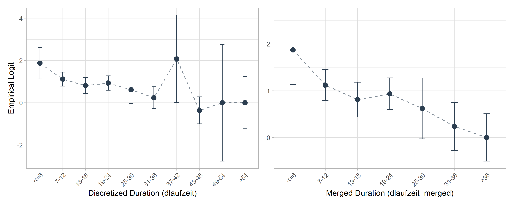
</p>

**Figure:** Logit extremes yielding a delta of $2.23$ in both plots (ranging from $1.87$ in bin $\le 6$ to $-0.36$ in bin $43-48$). For `dlaufzeit`, due to data sparsity in range of $>36$ months, there are structural breaks in the downward trend (e.g., spike to $2.08$ at $37-42$ months bin). Maximum CI width in category $49-54$ is approximately $5.54$ (L: $-2.77$, U: $2.77$, $n = 2$) and absorbs the CIs of bins $43-48$ and $> 54$. These categories exhibit similar empirical logits with overlapping CIs and thus an analogous effect on the response, which is why the categories $> 36$ are merged. The plot for `dlaufzeit_merged` shows in the right tail (aggregation of the four sparse categories, $n = 60$, empirical logit $= 0$) a stabilization in the CI width of $1.02$ (L: $-0.51$, U: $0.51$) and overall trend.


Both plots show an overall downward trend indicating that in total, the default risk raises with higher loan duration. 

Note: The empirical logit of bin $19-24$ does not provide a structural break in both plots, since its CI is nearly absorbed by the CIs of its neighboring categories. In particular for `dlaufzeit`, the bins $37-42$, $49-54$ and $>54$ are sparse, each consisting of $<1.5\%$ of the data records resulting in pairwise absorbing / highly overlapping CIs and thus they do not provide a structural break as well.


###### Repayment history
<p align="center">
  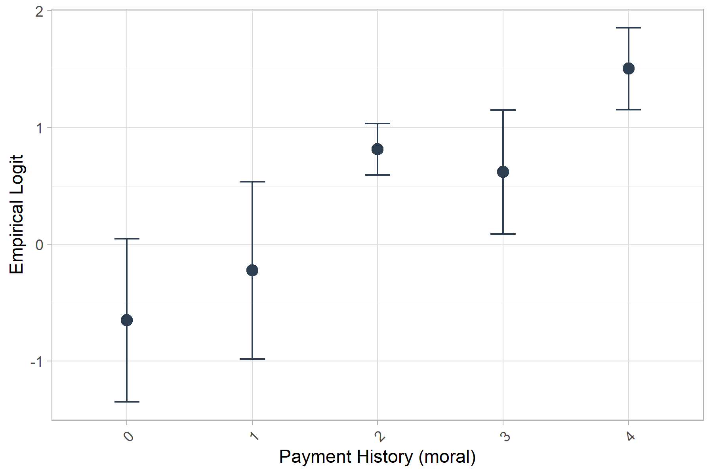
</p>

**Figure:** Marginal effect size delta of $2.15$ (extremes: level $4$: $1.50$ vs. level $0$: $-0.65$), with extremes in level $4$ and level $0$, exhibiting no CI overlap. Maximum CI width of $1.52$ (L: $-0.98$, U: $0.54$, $n = 27$) due to data sparsity is given in category $1$.

The plot shows overall a monotonic increasing trend between extreme categories $0$ (hesitant) and $4$ (clean), indicating that positive payment history raises the empirical repayment probability. The CIs of category $1$ and $2$ are disjoint and its empirical logits showing the highest increase between all categories, visually representing a distinction of the empirical repayment probability between consumers with negative and positive credit history. 

Note: The empirical logit of category $3$ is less than the one of category $2$. Since its CI absorbs the one of bin $2$, this does not provide a structural break and is explained by statistical noise due to a low amount of data records. Moreover, `moral` captures crucial qualitative risk categories. Despite similar effects on the response across bins $0, 1$ and $2, 3$,  merging them could eliminate critical risk differentiation.


###### Bankaccount status
<p align="center">
  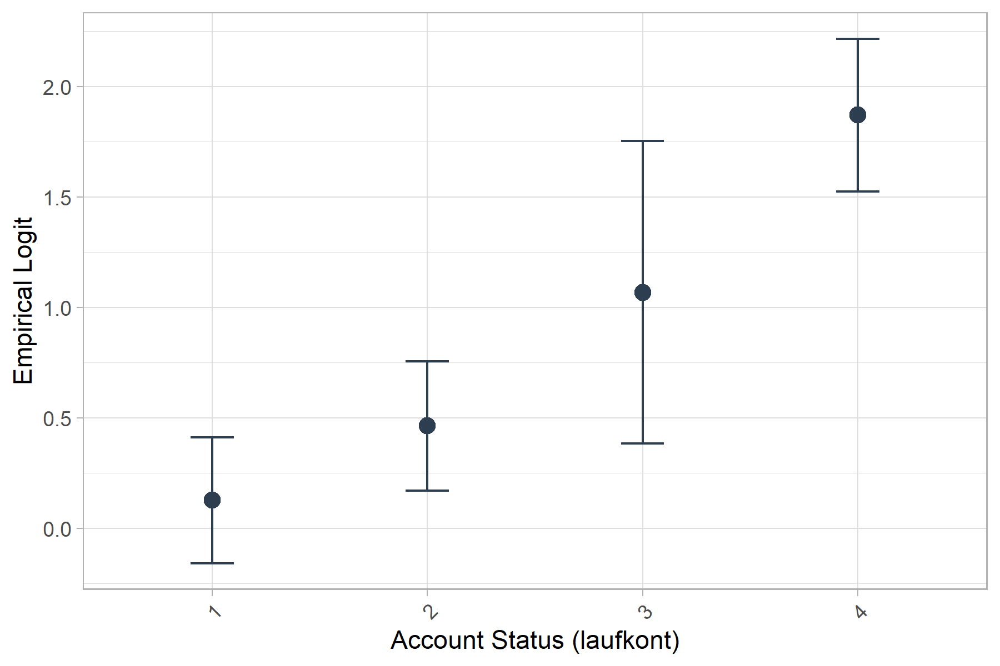
</p>

**Figure:** Marginal effect size delta of $1.74$ (extremes: level $4$: $1.87$ vs. level $1$: $0.13$), with extremes in level $4$ and level $1$, exhibiting no CI overlap. Bin $3$ shows a CI width $>1.30$ (L: $0.38$, U: $1.76$, $n = 43$) due to moderate data sparsity resulting in higher estimated variance.

The plot overall shows a monotonic upward trend with no structural breaks, indicating that an existing and covered bank account (bin $4$) increases the empirical repayment probability. All neighboring CIs are significantly overlapping, providing no clear distinction between adjacent categories. Nevertheless, the extremes visually separate high and low risk profile.


##### 2. Secondary Risk Driver (Moderate Delta, Structural Non-Linearity):
###### Age: raw vs merged
<p align="center">
  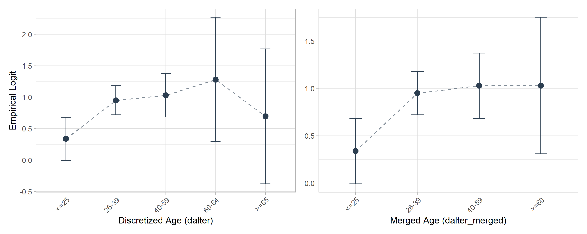
</p>

**Figure:** The marginal effect size delta is about $0.94$ (extremes: $1.28$ in bin $60-64$ vs. $0.34$ in bin $\le 25$). These categories show a substantial CI overlap. Bins $60-64$ ($3.3\%$) and $\ge 65$ ($2.1\%$) exhibit CI widths $>1.75$ (maximum CI width in category $\ge 65$ is $2.14$, L: $-0.38$, U: $1.76$, $n = 15$) due to high estimation variance caused by data sparsity. Despite the aggregation, the plot for `dalter_merged` shows high estimated variance in the right tail (aggregation of the two sparse upper categories, $n = 38$, empirical logit of $1.03$, and CI width of $1.44$, L: $0.31$, U: $1.75$), since the CI absorbs the CIs of bins $26-39$ and $40-59$ and strongly overlaps with the CI of category $\le 25$.

The plots for `dalter` and `dalter_merged` exhibit a concave, approximately quadratic structure. The categories $\le 25$ and $26-39$ have nearly distinct CIs and provide the only significant steep increase in empirical logits, visually indicating a distinction of the repayment rate between very low age groups and all others. This provides a higher baseline risk for very young borrowers, whereas the empirical repayment rate stabilizes and plateaus across all other age bins.

##### 3. Weak Risk Driver (Low Delta, Severe CI Overlap):
###### Occupation: raw vs merged
<p align="center">
  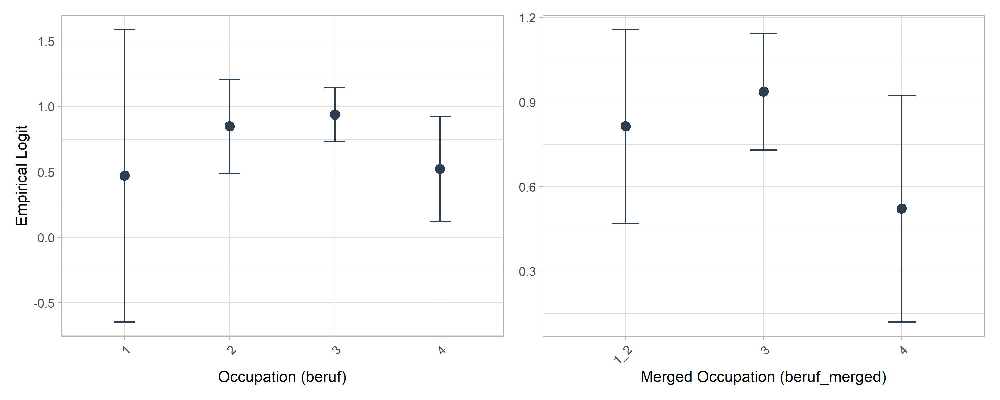
</p>

**Figure:** Marginal effect size delta for the merged plot is about $0.42$ (extremes: level $3$: $0.94$ vs. level $4$: $0.52$), adjusted from a delta of $0.47$ (extremes: level $3$: $0.94$ vs. level $1$: $0.47$) from the raw plot. The CI of category $1$ (CI width $> 2.00$, L: $-0.65$, U: $1.59$, $n = 13$) absorbs the CIs of all categories in the plot regarding `beruf`, caused by data sparsity. Merging categories $1$ and $2$ is valid, since both represent households with the lowest income and qualification level, only differing in having a permanent residence. This aggregation weakened the masking effect of the level $1$ bin and reduced the maximum CI width to $0.68$ (level $1\_2$, L: $0.47$, U: $1.15$, $n = 153$). 

Despite the data aggregation, CI overlaps persist across all levels, indicating a weak predictive effect on the response and providing no significant risk distinction across the categories.
 
#### Interaction effects
In the following the combined empirical logit plots for non-parallel trends are visually screened to detect possible interaction terms. Instead of regarding all combinations, the strongest main effects driven by hypotheses are analyzed. The empirical logits and their approximate CIs are calculated analogously as for the marginal effects - but with a continuity correction of $\frac{1}{2}$, since there exist cell-combinations without repayments or defaults. For sparse cells, this correction can influence the slopes of the linear interpolations between the logits. Moreover, only estimates of the logits are available, thus these plots should be treated as first diagnostic hint.


Detailed tabular summaries including bin sizes and approximate CIs are exported to 
[`output/tables/eda_interaction_summary.csv`](output/tables/eda_interaction_summary.csv). For the detailed comparison between the merged and unmerged interaction plots, see [`output/tables/eda_interaction_comparison.csv`](output/tables/eda_interaction_comparison.csv).

##### Laufzeit vs. Moral
The longer a loan runs (higher maturity), the higher the underlying risk of unforeseen life events (unemployment, illness).
Does an excellent credit history (moral = 4) provide better protection against this long-term risk than a critical history (moral = 0)?

<p align="center">
  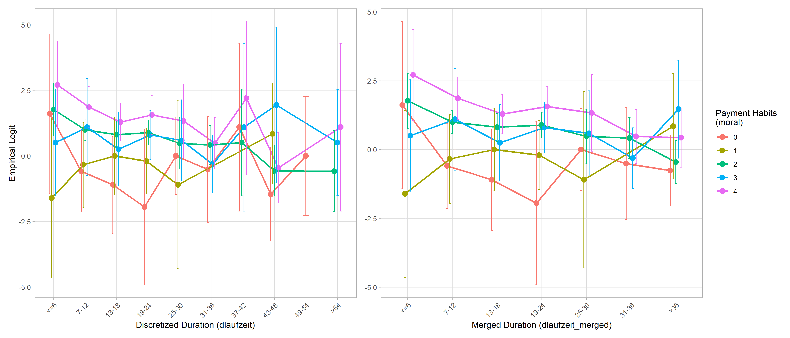
</p>

**Figure:** All duration bins exhibit broadly parallel trajectories. In the raw plot, line intersections (e.g., `moral` 0 crossing `moral` 3 at $37-42$ months) are driven by sparse cells ($n = 1$) with near-complete CI overlap. Visual deviations, such as the steep drop of `moral` 1 at $25-30$ months, are masked by CI widths $> 6.00$ logits (L: $-4.30$, U: $2.10$, $n = 1$). Similarly, the spike of `moral` 3 at $43-48$ months corresponds to a CI width $> 5.00$ logits (L: $-1.01$, U: $4.91$, $n = 1$). Data sparsity in duration bins $>36$ months yields overlapping CIs $> 4.00$ logits across categories. In the merged version, all duration bins maintain a nearly parallel trend. Deviations and line intersections in the right tail were weakened by the $>36$ aggregate, which reduced the maximum CI width in this aggregated bin to $3.82$ logits for `moral` 1 (L: $-1.06$, U: $2.76$, $n = 4$). Remaining line intersections are driven by 2D combinatorial cell sparsity with near-complete CI overlap, indicating high uncertainty. 

Across both plots, non-parallelism is indistinguishable from estimation variance, providing no robust visual evidence for an interaction effect.


##### Laufzeit vs. Laufkont
Account status proxies liquidity; duration defines time-at-risk.
Does high liquidity offset the risk of long-term loans, or do poor accounts amplify default risk over long durations (e.g., due to debt consolidation)?

<p align="center">
  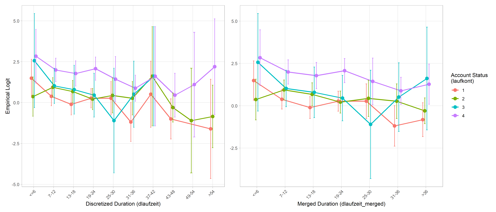
</p>

**Figure:** All duration bins exhibit broadly parallel downward trends. In the raw plot, line intersections (e.g., `laufkont` 1 crossing `laufkont` 2 at $37-42$ months) are caused by sparse cells ($n \le 3$) and involve near-complete CI overlap. Extreme visual deviations, such as the steep drop of `laufkont` 3 at $25-30$ months, are masked by CI widths $> 5.00$ logits (L: $-4.30$, U: $2.10$, $n = 1$). Moreover, data sparsity in duration bins $>36$ months yields CI widths $> 4.00$ logits across all categories. 
In the merged version, the structural trajectories maintain a nearly parallel trend. The CI widths in the new $>36$ aggregate are stabilized for dense categories (e.g., the CI width of `laufkont` 2 is reduced to $1.52$, L: $-1.06$, U: $0.46$, $n = 26$). Remaining extreme visual deviations are driven by sparse 2D cells (e.g., `laufkont` 3 at $>36$ months with $n = 2$ yields a masking CI width of $6.08$ logits, L: $-1.43$, U: $4.65$). 

Across both plots, deviations are bounded by combinatorial variance, and non-parallelism is indistinguishable from estimation variance. Hence, there is no robust visual indication for an interaction effect.

#####  Moral vs. Laufkont 
Current account status represents immediate liquidity, whereas payment history reflects long-term behavioral reliability.
Can high current liquidity compensate for the default risk of a critical payment history, or does a flawless payer remain low-risk even when currently overdrawn?

<p align="center">
  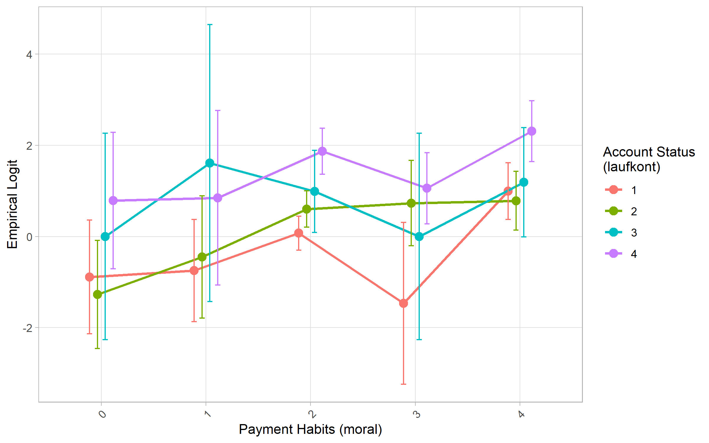
</p>

**Figure:** All categories exhibit broadly parallel upward trends. Apparent line intersections (e.g., `laufkont` $1$ crossing `laufkont` $2$ between `moral` $3$ and $4$) involve sparse cells with substantial CI overlap. The visual deviation of `laufkont` $1$ at `moral` $3$ is masked by a CI width of $3.56$ logits ($n = 7$). Extreme outliers, such as the spike of `laufkont` $3$ at `moral` $1$ ($n = 2$), exhibit CI widths $> 6.00$ logits.

Apparent non-parallelism is mainly driven by estimation variance. Therefore, there is no robust visual evidence for significant interaction effects.


#####  Alter vs Laufzeit 
Risk exposure tends to vary over time depending on one's stage of life (young and volatile vs. middle-aged and financially stable).
Does the temporal risk of long-term borrowing scale additively across age groups or do extremely young/old borrowers face disproportionate default probabilities over long durations?

<p align="center">
  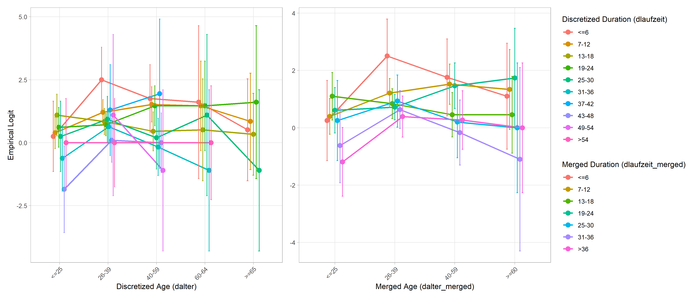
</p>

**Figure:** In the raw plot, some trajectories appear non-parallel (e.g., categories $43-48$ and $49-54$ months). The CIs exhibit near-complete overlap across all age groups, spanning $> 5.00$ logits. The plot is characterized by high estimation variance.
In the merged version, the estimation variance is reduced. Merging sparse bins of the underlying covariates (age $\ge 60$, duration $> 36$) yields trajectories that show a nearly parallel trend. The CI width in the joint extreme tail (age $\ge 60$ at duration $> 36$) is equal to $4.52$ logits (L: $-2.26$, U: $2.26$, $n = 2$), driven rather by combinatorial 2D sparsity than marginal instability.

Across both plots, structural differences are indistinguishable from statistical noise. Hence, there is no robust visual indication for an interaction effect.


#### Continuous Predictors
The only continuous covariates under consideration are `alter` and `laufzeit`. Their influence on the response was examined in the previous section, where their discretized versions were considered.
For instance, the logit plot for `dalter` showed a concave quadratic shape, whereas the one for `dlaufzeit` revealed a linear decreasing trend. In the following, the relationship of these covariates with the response is further investigated using Generalized Additive Models (GAMs).

##### Functional Form Assessment
To assess the functional form, the `gam` function from the `mgcv` package is utilized to estimate the shape of the covariates via smoothing splines. The Estimated Degrees of Freedom (EDF) correspond to the complexity of the estimated shape.

| Predictor | EDF | p-value | GAM Assessment | Decision |
| :--- | :--- | :--- | :--- | :--- |
| **`alter`** | $1.903$ | $0.0246$ | Significant non-linear (approx. quadratic) relationship | Investigate quadratic transformation |
| **`laufzeit`** | $1.000$ | $< 0.001$ | Significant linear downward trend | Retain linear main effects |

<p align="center">
  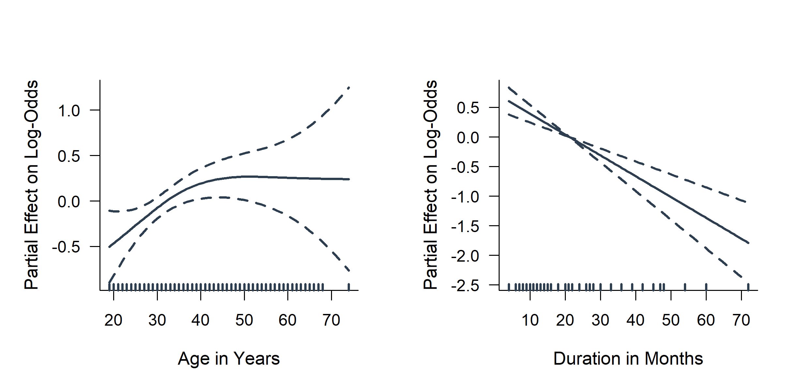
</p>

**Figure:** GAM smooths for continuous predictors. The marginal effect of `alter` yields an EDF of $1.903$, which corresponds to the approximately quadratic structure previously recognized by the empirical logit plots. Similarly, the marginal effect of `laufzeit`  (EDF of $1.000$) evidences the linear trend on the log-odds.

Consequently, a quadratic polynomial transformation for `alter` and the additive effect of `laufzeit` are investigated in the subsequent model selection phase.

---

## Model Selection
The objective of this section is to build a model based on the previously executed EDA. The goal is to maximize predictive performance while preserving interpretability. 

### Framework and Strategy
Candidate models are compared and ranked via the Akaike Information Criterion (AIC) as the primary predictive metric, and the Bayesian Information Criterion (BIC) as a sensitivity check.
Both criteria, AIC and BIC, balance model fit against complexity, while BIC applies a stricter penalty for the number of estimated parameters ($k$) based on the whole sample size ($n = 699$):
$$
\text{AIC} = -2\ell(\hat{\boldsymbol{\beta}}) + 2k, \quad \text{BIC} = -2\ell(\hat{\boldsymbol{\beta}}) + \ln(n)k,
$$
whereby $\ell$ denotes the binomial log-likelihood. For pre-selecting an appropriate model out of the regarded covariates, stepwise selection via the step() function is executed. The algorithm iteratively adds or drops covariates, computes the AIC / BIC for all candidate models and chooses the one with lowest AIC / BIC.

Nested candidate models are compared with the Likelihood Ratio Test (LRT). The test statistic $G^2$ is equivalent to the difference in residual deviances ($\Delta D$) between the reduced and the full model:

$$G^2 = D_{\text{reduced}} - D_{\text{full}} = 2\left[ \ell(\hat{\boldsymbol{\beta}}_{\text{full}}) - \ell(\hat{\boldsymbol{\beta}}_{\text{reduced}}) \right]$$

Under the assumption that the smaller model is more appropriate, the test statistic $G^2$ follows a $\chi^2$ distribution, where the degrees of freedom correspond to the difference in the number of parameters between the full and the nested model.


### Functional Form Selection
In the following, AIC and BIC of the null model plus one specification of `laufzeit`, `alter` or `beruf` are compared in accordance with the findings in the EDA and GAM analysis.


| Predictor | Specification | AIC | BIC |
| :--- | :--- | :--- | :--- |
| **`laufzeit`** | Continuous | **810.35** | **819.45** |
| | Raw (Discretized) | 818.25 | 863.75 |
| | Merged (Categorical) | 819.71 | 851.56 |
| **`alter`** | Continuous (Linear) | 832.29 | **841.38** |
| | Continuous (Quadratic) | **830.77** | 844.42 |
| | Raw (Discretized) | 833.25 | 856.00 |
| | Merged (Categorical) | 831.87 | 850.07 |
| **`beruf`** | Raw (Categorical) | 838.43 | 856.63 |
| | Merged (Categorical) | **836.82** | **850.47** |


Consistent with the GAM results (strictly linear smooth), the continuous specification `laufzeit` significantly outperforms both discretizations in BIC and AIC. 

The linear form of `alter` achieves the lowest BIC and the quadratic form achieves the lowest AIC. 
Although the merged form yields a similar AIC score, it is outperformed by the linear form in BIC and therefore excluded. The AIC difference of approximately $1.5$ with respect to the linear and quadratic specification only indicates a tiny improvement in model fit. However, the GAM showed a significantly non-linear (quadratic) effect for age. Since the main goal is predictability, the result of AIC is used.

The merged form of `beruf` achieves the lowest AIC and BIC. Therefore, `beruf_merged` is retained.

Consequently, the following full model (without interaction terms) is selected:

$$
\text{logit}(\pi_j) = \beta_0 + \beta_1\,\text{laufzeit}_j + \beta_2\,\text{laufkont}_j + \beta_3\,\text{alter}_j + \beta_4\,\text{alter}{_j}^2 + \beta_5\,\text{beruf_merged}_j + \beta_6\,\text{moral}_j
$$

Note: For notational compactness, categorical predictors are represented as single terms. They are implemented as indicator variables with respect to their underlying reference categories. 


### Stepwise Model Selection
To identify an appropriate baseline model, forward and backward stepwise selection algorithms are applied to the null and full candidate models respectively.

| Criterion | Algorithm Direction | Selected Covariates |
| :--- | :--- | :--- |
| **BIC** | Forward, Backward | `laufzeit`, `laufkont` |
| **AIC** | Forward | `laufzeit`, `laufkont`, `moral` |
| **AIC** | Backward | `laufzeit`, `laufkont`, `moral`, `alter`, `alter^2` |

Forward and backward selection via AIC yield a different specification. Both models differ from the one achieved with the selection algorithms based on BIC.

### Nested Model Comparison
Next, these nested models are compared using LRT.

| Baseline Model | Added Covariate(s) | LRT p-value | Conclusion |
| :--- | :--- | :--- | :--- |
| `laufzeit` + `laufkont` | `moral` | $< 0.001$ | Significant model improvement. Retain `moral`. |
| `laufzeit` + `laufkont` + `moral` | `alter` + `alter^2` | $0.171$ | No significant improvement. Exclude age terms. |

The formal tests indicate that `moral` contributes significant predictive information, while the terms of `alter` do not. 
For a final decision, the AIC and BIC values of the remaining two models are compared:

| Specification | Covariates | AIC | BIC |
| :--- | :--- | :--- | :--- |
| Minimal Model | `laufzeit`, `laufkont` | $745.59$ | **$768.34$** |
| **Main Effects** | `laufzeit`, `laufkont`, `moral` | **$730.57$** | $771.52$

Adding the covariate `moral` yields a positive but not strong BIC penalty ($\Delta = +3.18$). The AIC improvement ($\Delta = -15.02$) is significant. 
Since the BIC is used as sensitivity check and the main objective is minimizing the out-of-sample error, this result validates the inclusion of `moral`.

The final main effect model is given by:

$$
\text{logit}(\pi_j) = \beta_0 + \beta_1\,\text{laufzeit}_j + \beta_2\,\text{laufkont}_j + \beta_3\,\text{moral}_j
$$


### Interaction Effects

The EDA provided no visual indication of significant interaction effects. This hypothesis is evaluated via LRTs by individually adding the regarded interaction terms to the final main effect model.

| Baseline Model | Tested Interaction | LRT p-value | Conclusion |
| :--- | :--- | :--- | :--- |
| Main Effects | `laufzeit:laufkont` | $0.727$ | Not significant. Exclude. |
| Main Effects | `moral:laufkont` | $0.623$ | Not significant. Exclude. |
| Main Effects | `laufzeit:moral` | $0.024$ | Weakly significant. |

The interaction effect between `laufzeit` and `moral` is further investigated by comparing AIC and BIC values to assess the predictive power under consideration of the additional model complexity.

| Specification | AIC | BIC |
| :--- | :--- | :--- |
| Main Effects Model | $730.57$ | **$771.52$** |
| Main Effects + `laufzeit:moral` | **$727.35$** | $786.49$ |


The weak p-value $\text{p} = 0.02411$ in the LRT and the minor AIC reduction ($\Delta \text{AIC} = 3.22$) provide weak support for the interaction term `laufzeit:moral`. Conversely, the BIC penalizes the parameter expansion, rejecting the interaction ($\Delta \text{BIC} = +14.97$).
The weak in-sample significance of the interaction term is likely driven by statistical noise rather than a true structural effect. As discussed in the EDA-section, non-parallel trajectories are strictly isolated to 2D combinatorial cell sparsity (n $\le 2$) and are masked by CI widths $> 4.00$ logits. Therefore, to prevent overfitting and to maximize out-of-sample robustness, the interaction term `laufzeit:moral` is excluded.

The final predictive model is the strictly parsimonious main effects specification, consisting of the covariates `laufzeit`, `laufkont`, `moral`.


### Odds of Success

Let $x$ be a single covariate, consider the model $\eta_j = \beta_0 + \beta_1 x_j$, which is equivalent to $p_j = \frac{\exp(\eta_j)}{1 + \exp(\eta_j)}$. 
Hence, $\eta_j = \ln(o_j)$, whereby $o(x_j) = o_j = \frac{p_j}{1 - p_j}$ is the odds of success with respect to the $j^{\text{th}}$ observation. 

#### 1) $x$ is continuous
Increasing $x_j$ by one unit changes the odds of success by a factor:

$$
\frac{o(x_j + 1)}{o(x_j)} = \frac{\exp(\ln(o(x_j + 1)))}{\exp(\ln(o(x_j)))} = \exp(\beta_1)
$$

Hence, increasing the underlying continuous covariate by one unit multiplies the odds of success by $\exp(\beta_1)$.
* If $\beta_1 > 0$, then the ratio of repayment to default increases. 
* If $\beta_1 < 0$, then the ratio of repayment to default decreases.

#### 2) $x$ is discrete with $K$ categories 
Then $x$ is coded as a dummy variable and it holds: 

$$
\eta_j = \beta_0 + \beta_2 I_2(j) + \ldots + \beta_K I_{K}(j)
$$

and $\eta_1 = \beta_0$, where $1$ is the reference category. Using $K-1$ indicator variables avoids a degenerated design matrix. 
It holds $\eta_j = \ln(o_j)$.

The odds ratio between a category $k \in \{2, \dots, K\}$ and the reference category is given via:

$$
\frac{o_k}{o_1} = \frac{\exp(\eta_k)}{\exp(\eta_1)} = \exp(\beta_k)
$$

* If $\beta_k > 0$, the ratio of repayment to default is higher than in the reference group.
* If $\beta_k < 0$, the ratio of repayment to default is lower than in the reference group.

Moreover, the approximate CIs of the odds ratios can be calculated: Let $\hat{\beta}$ be the maximum likelihood estimator and $\text{SE}(\hat{\beta})$ its standard error. Under standard regularity conditions, this estimator is asymptotically normally distributed. Consequently, its asymptotic $ 95 \%$ CI can be calculated via $\hat{\beta} \pm z_{0.975} \cdot \text{SE}(\hat{\beta})$. Applying the exponential function to the boundaries of this interval yields an asymptotic $95 \%$ CI for the odds ratios. Therefore, the CIs are very large, when the estimate $\hat{\beta}$ is greater than $1$.

The estimated coefficients, the odds ratios as well as the asymptotic CIs are provided in the following table:

| Predictor | Level / Unit | Estimate ($\hat{\beta}$) | Odds Ratio | 95% Confidence Interval |
| :--- | :--- | :--- | :--- | :--- |
| **(Intercept)** | - | $-0.434$ | $0.648$ | $[0.261, 1.556]$ |
| **`laufzeit`** | per 1 month | $-0.030$ | $0.970$ | $[0.956, 0.984]$ |
| **`laufkont`** | Level 1 *(Reference)* | *0.000* | *1.000* | *-* |
| | Level 2 | $0.452$ | $1.571$ | $[1.021, 2.428]$ |
| | Level 3 | $0.817$ | $2.263$ | $[1.075, 5.077]$ |
| | Level 4 | $1.707$ | $5.510$ | $[3.463, 8.917]$ |
| **`moral`** | Level 0 *(Reference)* | *0.000* | *1.000* | *-* |
| | Level 1 | $0.434$ | $1.544$ | $[0.513, 4.700]$ |
| | Level 2 | $1.201$ | $3.324$ | $[1.526, 7.570]$ |
| | Level 3 | $0.879$ | $2.409$ | $[0.946, 6.373]$ |
| | Level 4 | $1.724$ | $5.607$ | $[2.449, 13.386]$ |

To illustrate the practical implications of the model, a few key effects are highlighted by translating the estimated odds ratios into their business context:

* **Continuous Effect (`laufzeit`):** The odds ratio of $0.970$ indicates that each additional month of loan duration reduces the repayment-to-default odds by $3\%$. For instance, extending a loan duration over four years drops the repayment odds by a factor of $0.970^{48} \approx 0.23$, i. e., the relation of defaults to repayments is $\frac{1}{0.23} = 4.31$ times higher after four years.

* **Categorical Effect (`laufkont`):** The reference group (Level 1) consists of applicants with no checking account at the bank, which is a black box risk. Even borrowers with a zero or debit balance (Level 2) exhibit a repayment-to-default ratio that is $1.571$ times higher. This odds ratio increases with financial stability: borrowers with a solid balance or a long-standing salary account (Level 4) exhibit odds of repayment $5.510$ times higher than the reference group, highlighting established, long-term liquidity as significant for a repayment.

* **Categorical Effect (`moral`):** The reference group (Level 0) consists of borrowers with a historically hesitant credit management. Applicants with a neutral or clean history, such as having no previous credits or having fully paid them back (Level 2), exhibit a repayment-to-default ratio that is $3.324$ times higher. This odds ratio peaks for borrowers who have flawlessly handled previous credits at the same bank (Level 4) exhibiting odds of repayment $5.607$ times higher than the reference group.


These metrics coincide with the marginal exploratory data analysis: Existing savings/account statuses and a clean credit history are dominant drivers for a positive credit outcome, while long-term loans structurally raise the default risk.

---

## Model Diagnostics
In this section, diagnostics are performed to check whether the model assumptions and specifications are plausible. Moreover, observations that have an excessive influence on the regression result are detected and analyzed.

### Goodness-of-Fit
The residual deviance measures how close the fitted means are to the observations, by comparing the mean-parametrized log-likelihood of the selected model with the one of the saturated model ($#$ parameters $=$ $#$ observations), where each observation is considered as an estimate of the mean.
Under the assumption that the binomial model is correctly specified and standard regularity conditions hold, the residual deviance is asymptotically $\chi_{n - p}^2$-distributed, whereby $n$ is the amount of grouped observations and $p$ is the number of parameters. Let $\mathbb{P}$ be the law of a $\chi^2$ distributed random variable, with $n - p = 654 - 9 = 645$ degrees of freedom.
The residual deviance of the selected model is $ d = 693.85$. It holds $\mathbb{P}((d, \infty)) = 0.089 > 0.05$, thus the residual deviance test fails to reject the hypothesis of an adequate model fit at a significance level of $5 \%$.

The Pearson-$\chi^2$-statistic $X^2$ is defined as the sum of squared Pearson residuals, where each summand represents the ratio of the squared empirical deviation to the theoretical binomial variance.
Under the same assumptions as above, it is $\chi^2$ distributed with $n - p = 645$ degrees of freedom. The Pearson statistic of this model is $x^2 = 647.12$. It holds $\mathbb{P}((x^2, \infty)) = 0.469 >> 0.05$, thus the Pearson-$\chi^2$-test fails to reject the hypothesis of an adequate model fit at level of $5 \%$. 

Note: Failure to reject the null hypothesis does not prove that the model is correctly specified.

### Functional Form Assessment
Based on the EDA and AIC/BIC results, the covariate `laufzeit` was modeled as a linear effect. The partial residual plot scatters `laufzeit` against the partial residuals to reveal the isolated relationship between the residuals and the regressor variable. Note that `laufzeit` is the only continuous covariate in this model.

<p align="center">
  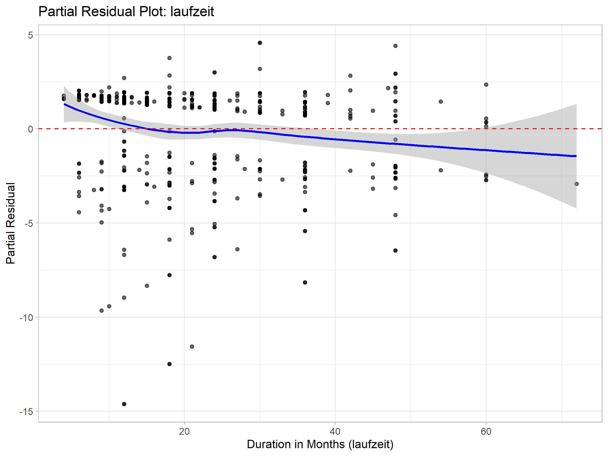
</p>

**Figure:** Partial residual plot for the continuous covariate `laufzeit`. The plot displays two distinct point clouds due to the binary response structure. The overlaid LOESS smoothing line (blue) roughly follows a horizontal trend around zero. Wide CIs for durations $> 40$ months are caused by data sparsity. 

The plot reveals no clear non-linear trend and no hint of systematic deviation in the dense regions. Thus, there is no strong indication against modelling `laufzeit` as an additive linear effect.


### Residual Analysis
In the following, the residual values against the fitted probabilities are plotted to visually check for a systematic lack of fit. The adjusted Pearson residuals are used, since they have approximately unit variance and thus artifacts driven by the theoretical variance are removed.
Residual signs can be interpreted as follows:

* Negative residuals correspond to unexpected defaults, i. e., the model predicts a repayment but the observation corresponds to a loan default.
* Positive residuals correspond to unexpected successes, i. e., the model predicts a default, but the loan was repaid. 


<p align="center">
  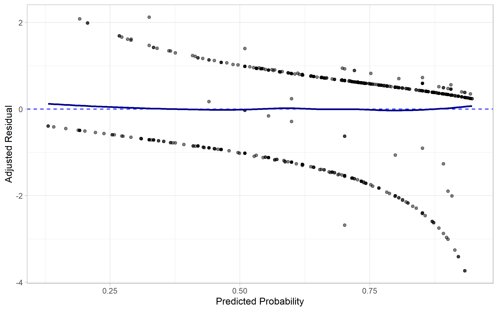
</p>


**Figure:** The residual plot shows asymmetric bounds ($-4$ for unexpected defaults vs. $+2$ for unexpected successes). This asymmetry may partly reflect the binary response structure and the distribution of fitted probabilities, given the high repayment rate (approximately $70 \%$) in the data. The LOESS curve is approximately flat, providing no clear visual evidence of systematic deviations in the residuals, which could be caused by structural misspecification such as chosen link function or modeled covariates.

Note: Due to the underlying asymmetric risk structure, unexpected defaults are more costly than unexpected successes. 

### Influential Observations
Cook's distance is used to assess the influence of individual observations on the fitted model by measuring the change in the estimated regression coefficients when an observation is removed.

<p align="center">
  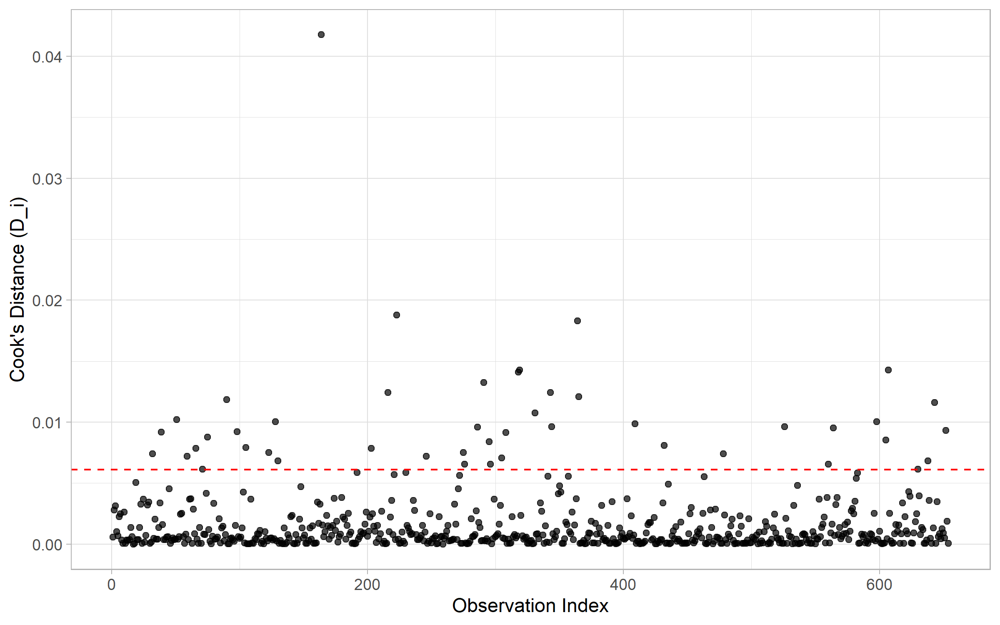
</p>

**Figure:**  The maximum value is approximately $0.04$, thus all Cook's distances lie well below the critical threshold of $1$. The red dashed line represents the practical threshold of $\frac{4}{n}$ for sensitive screening. The vast majority lie below this threshold. 


In the following, it is examined how much each regression coefficient changes if the most influential observation is removed. 
The top outlier represents a grouped observation of two borrowers who repaid their credit with a duration of two years, despite a high-risk profile. Both have no current account (bin $1$ of `laufkont`) resulting in a black-box risk. Moreover, they have a critical credit history with external debts (bin $1$ of `moral`) - the ratio of repayment to default for this category is approximately $1.544$ times higher than that of borrowers with hesitant credit management. 

The discrepancy between low predicted probability of $32.54 \%$ and the empirical success is responsible for the large Cook's distance.

The change of the following coefficients $\hat{\beta}$ is above the screening threshold of $\frac{2}{\sqrt{n}} = 0.078 $ standard errors (SEs):

| Coefficient | Variable Category | DFBETAS Shift in SEs |
|---|---|---|
| `moral` | $1$ | $+0.42$ |
| `laufkont`| $2$ | $-0.14$ |
| `laufkont` | $3$ | $+0.08$ |
| `laufkont` | $4$ | $-0.11$ |

The outlier has a noticeable effect on selected regression coefficients but does not cause an extreme change in the coefficient estimates since all DFBETAS values are bounded between $\pm 1$.

Finally, a combined diagnostic plot of adjusted pearson residuals against leverage is performed to visually detect outliers and extreme covariate profiles. The leverage of an observed covariate reflects the potential influence of a data point on the fit and is measured by the diagonal elements $h_{ii}$ of the hat matrix. A point is defined to have extreme covariate profile, if $h_{ii} > \frac{2p}{n}$. Data points with adjusted Pearson residuals outside of $[-2, 2]$ are regarded as outliers. Moreover, a data point is potentially influential, if it is an outlier and has extreme covariate profile. Particular attention is paid to observations with negative residuals, since they correspond to wrongly predicted defaults that may significantly influence the parameter estimation.


<p align="center">
  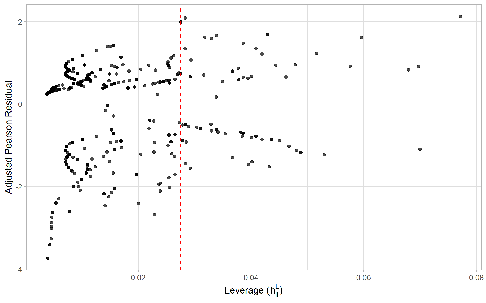
</p>


**Figure:** Points on the right-hand side of the vertical dashed red line correspond to extreme covariate profiles. There exist several outliers with negative residuals, but their leverage is low. Numerous observations exceed the leverage threshold, but are not influential. In particular, there exists no observation with high leverage and negative residual. The single influential observation on the top right with positive residual corresponds to the observation with largest Cook's distance. As discussed above, this observation represents a plausible extreme case rather than clear evidence of model misspecification.


## Model Performance
The model predicts probabilities in $(0, 1)$, therefore a threshold has to be defined when the model should reject a loan.

### Cost Sensitive Thresholds
The costs of a misprediction are asymmetrically distributed: Wrongly predicted defaults are more costly than foregone interest rate margins due to rejecting a loan. 

Per observation, the amount of a loan is captured by the covariate `hoehe` (in €).  The average duration of a loan is calculated as the median of `laufzeit`, which is equal to $18$ months. 
It is assumed that per default, the bank suffers on average a capital loss of $60 \%$ of the credit amount, which is refered to as the loss given default (`lgd`).
Therefore, the (potential) loss of capital (`lc`) is calculated as `lc` $=$ `hoehe` $\cdot$ `lgd`. 
Moreover, assume that per consumer credit receives in average an interest rate (`ir`) of $6.5 \%$ per annum. 
Then, the interest rate margin (`irm`) can be calculated as `irm` = `hoehe` $\cdot ($ `laufzeit` $/ 12) \cdot$ `ir`. Moreover, let `rir` = `irm` $/$ `hoehe` be the average accumulated interest rate.
With this, the cost ratio (`cr`) can then be calculated as `cr` $=$ `lc` $/$ `irm`. Under the made assumptions, it is approximately equal to $7$.
This means that a credit default costs the bank $7$ times more than a foregone interest rate margin.

The following table summarizes these definitions:

| Variable | Description | Definition | Value |
| :--- | :--- | :--- | :---: |
| `hoehe` | Amount (in €) | Captured per observation | / |  
| `laufzeit` | Duration (in months) | Captured per observation  | $18$ months (median) |
| `lgd` | Loss Given Default | Assumption | $60 \%$ |
| `lc` | Loss of capital | `lc` = `hoehe` $\cdot$ `lgd` | / |
| `ir` | Average interest rate (p. a.) | Assumption | $6.5 \%$ |
| `irm` | Interest rate margin | `hoehe` $\cdot$ `laufzeit` (in years) $\cdot$ `ir` | / |
| `rir` | Relative interest margin | `irm` $/$ `hoehe` | / |
| `cr` | Cost ratio | `lc` $/$ `irm` | $\approx 7$ |


#### Empirical Cost Minimization

In the following, the threshold is calculated that minimizes the costs for the bank under consideration of the assumed cost ratio. For this cost sensitive threshold optimization, the function `pROC::roc` is used: First, the method `thresholds` yields an exhaustive list of all possible thresholds by extracting the unique sorted predicted probabilities of the model.
Then, for each of these thresholds the empirical costs are calculated as follows: Each false negative predictor counts one unit, while each false positive predictor counts `cr` $ = 7$ times. Note that the penalty of $1$ for each false negative prediction serves as a regularizer: Without a penalty, the best strategy would be to reject every loan. Then, the threshold is selected causing minimal costs, which is approximately $0.87$. This means, if the model predicts a probability less than $0.87$, the bank rejects the loan.  


#### Empirical Profit Maximization

The ansatz of costs minimization ignores that the bank gains a yield for each repaied loan. Analogously to the empirical costs, the empirical profit is calculated for each possible threshold: If the model predicts a repayment correctly, the bank gains the interest rate margin `irm`, if the predictor is false positive, the bank pays the loss of capital `lc`. This method does not use a regularizer. The calculated threshold is approximately $0.84$. In particular, the bank approves more loans with this strategy than with the one of empirical cost minimization.


#### Break-Even Point as Threshold

The probability $q \in (0, 1)$ so that the expected yield is zero can be calculated as follows: 

$$
\begin{aligned}
\hphantom{\iff} & q \cdot \text{irm} - (1 - q) \cdot \text{lc} = 0 \\
\iff & q \cdot \text{rir} - (1 - q) \cdot \text{lgd} = 0 \\
\iff & q = \frac{\text{lgd}}{\text{rir} + \text{lgd}}
\end{aligned}
$$

The Break-Even-Threshold $q$ is approximately $0.86$ and thus smaller than the cost-minimization threshold ($0.874$), but larger than the profit-maximization threshold ($0.842$).


### ROC Plot
In the following, a ROC plot is used to visually compare the selected thresholds in face of the asymmetric cost structure.

<p align="center">
  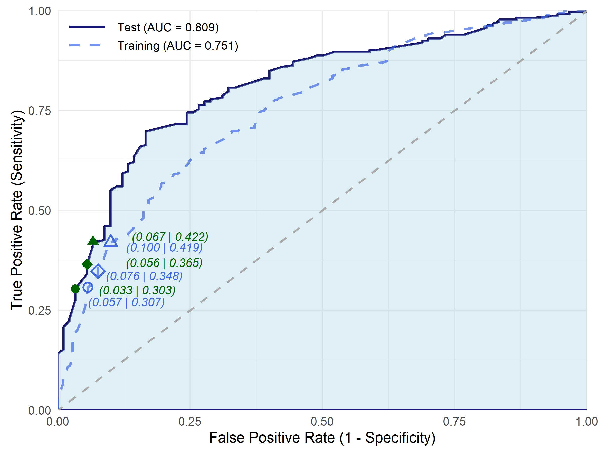
</p>

**Figure:**  Training and test ROC curves remain well above the random-guess baseline, indicating a general capacity to rank credit risk profiles across unseen data. The higher test AUC ($0.809$) relative to the train AUC ($0.751$) may be a statistical artifact driven by sampling variance in the test split. The circles represent the threshold gained by cost minimization, the diamonds correspond to the break-even threshold and the triangles to the one of the profit maximization. The training and test markers are closely aligned, indicating a robust generalization to the population. All markers have a low false positive rate, which reflects the objective of limiting the high costs of a default. 

In a neighborhood of the points corresponding to the cost minimization and break-even threshold, the slope of the ROC curve is steep in both directions. Thus, taking risk into account by lowering these threshold yields disproportionately more gains than defaults. The data point corresponding to the threshold calculated by empirical profit maximization sits on a local saddle point, thus decreasing the threshold causes more additional debts than repayments, while increasing this threshold causes proportionately more foregone interest rates than debts.


### Calibration Plots
While the ROC analysis assesses the model's ranking power, calibration evaluates whether predicted default probabilities accurately match empirical default rates. For this, observations are grouped into risk categories, which are compared by plotting the mean predicted probability against the observed default frequency:

- **Below the diagonal ($y < x$):** The model overestimates default risk (conservative/pessimistic bias).
- **Above the diagonal ($y > x$):** The model underestimates default risk (optimistic/aggressive bias).


#### Rating Classes
For a first summarizing view, the observations are grouped into rating classes A-G.

| Rating Grade | Risk Category | Predicted Default Probability Range |
| :---: | :--- | :---: |
| **A** | Prime | ≤ 0.5% |
| **B** | Very Good | (0.5%, 1.5%] |
| **C** | Good | (1.5%, 5.0%] |
| **D** | Acceptable | (5.0%, 10.0%] |
| **E** | High Risk | (10.0%, 20.0%] |
| **F** | Watchlist | (20.0%, 50.0%] |
| **G** | Default Risk | > 50.0% |


<p align="center">
  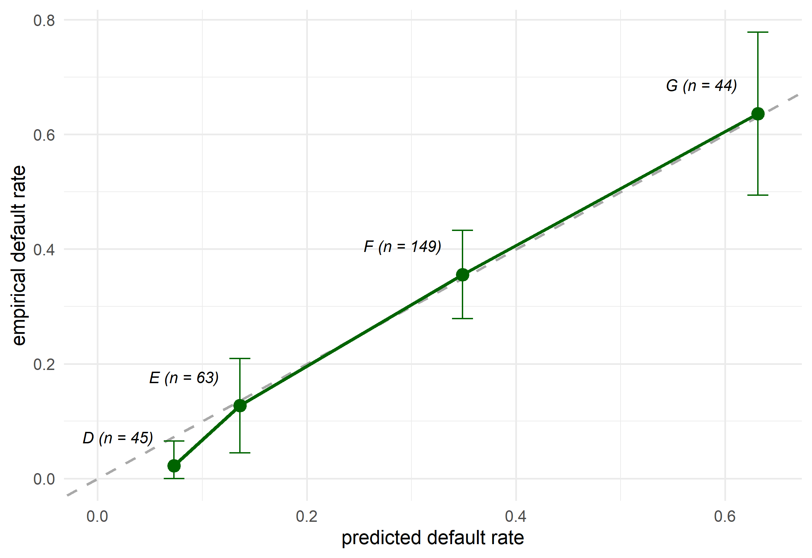
</p>

**Figure:** Calibration curve across credit rating grades (A–G) with  $95 \%$ confidence intervals and theoretical calibration line ($y = x$). For the poor customers (Classes F and G, top right), the points lie almost perfectly on the dashed line ($y = x$), indicating solid calibration for the aggregated high-risk profiles. The width of the CI for point G is large (approx. $0.28$), since with $44$ records class G is the smallest bin and the empirical default rate of approximately $64\%$ is influenced by the maximum of variance of a binomial distribution $p(1-p)$ at $p = 0.5$. Despite the large CI, the model is accurate in estimating expected defaults for high-risk customers. For the good customers (Class D, bottom left), the point lies below the calibration line, in particular, the model predicts an average default rate of $\sim 8 \%$ (x-axis), but empirically, the default is approximately $2 \%$ (y-axis). This means, the model assesses these customers as worse/riskier than they actually are. It overestimates their risk. Note, there exist no observations falling into rating classes A - C. 


#### Deciles
Deciles ensure a constant sample size per bin and therefore stabilize the standard error. 

<p align="center">
  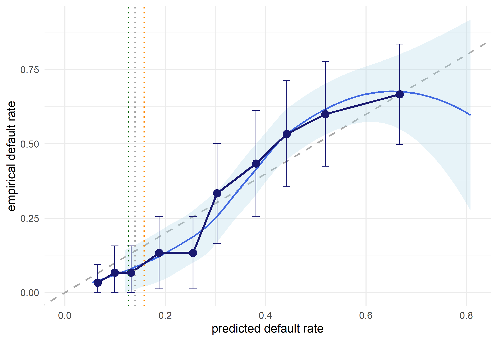
</p>

**Figure:** Calibration curve across ten deciles with  $95 \%$ confidence intervals, smoothing curve and theoretical calibration line ($y = x$).
The smoothing curve has a cubic polynomial shape relative to the 45-degree calibration diagonal ($y = x$). The dashed vertical lines specify the maximum allowable default risk range for the thresholds corresponding to cost minimization (green), the break-even (grey) and profit maximization strategy  (orange)

- *Low default risk ($x < 0.30$):* The LOESS curve and deciles lie below the dashed line ($y < x$), i. e., the model systematically overestimates the default risk in this region (conservative bias).
- *Medium to high default risk ($0.30 \le x \le 0.65$):* The LOESS curve and deciles cross the dashed line and lie above it ($y > x$), i. e., the model systematically underestimates the default risk in this region (optimistic bias).
- *Extreme default risk ($x > 0.65$):* The highest decile point aligns closely with the dashed line ($y = x$). The LOESS curve drops with a large CI, which is an artifact of horizontal data sparsity: The highest decile is stretched across a wide probability range, resulting in large estimated variance.

The space along the x-axis between the conservative thresholds (grey / green) and the profit threshold (orange) represents the strategic opportunity zone. Applicants falling into this probability range are rejected under cost-minimization but approved under profit-maximization. The opportunity zone lies below the calibration diagonal ($y < x$) - i. e., as the bank shifts its policy from the green to the orange line to capture more market share, the newly accepted applicants are systematically less risky in reality than their predicted probabilities suggest.


#### Conclusion
The decile plot confirms the global boundaries of the risk class plot, but reveals a hidden local vulnerability. 
Both plots show that for low-risk customers (Class D / Deciles with $x < 0.30$), the model overestimates default risk. The resulting foregone interest rate margins are not as expensive as wrongly predicted defaults.
Moreover, both plots confirm that the absolute highest risk tier (Class G / $10^{\text{th}}$ Decile) is well-calibrated, since the corresponding point sits on the calibration line.
But, the decile plot reveals a systematic underestimation of risk in the medium-to-high range ($0.30 \le x \le 0.65$). The largest Class F ($n = 149$) aggregates this entire region into a single point, averaging out the variance and making it appear perfectly calibrated.

### Decision of Strategy: Cost Minimization vs. Profit Maximization
To determine the optimal decision threshold, operational and financial KPIs are evaluated across candidate strategies under empirical lending constraints ($\text{LGD} = 60\%$, interest margin $= 6.5\%$).

| Strategy | Decision Threshold | Approval Rate | Defaults | Net Profit | Profit Margin |
| :--- | :---: | :---: | :---: | :---: | :---: |
| **Cost Minimization** | 0.874 | 23.2% | 12 | 9,179.97 | 2.42% |
| **Profit Maximization** | 0.842 | 32.3% | 21 | 9,420.07 | 1.64% |
| **Break-Even** | 0.860 | 26.6% | 16 | 5,086.49 | 1.09% |
| **Market Share (Growth)** | 0.700 | 57.7% | 68 | -45,194.17 | -4.20% |

- **Absolute- and relative return:** While Cost Minimization yields a higher relative profit margin ($2.42\%$ vs. $1.64\%$), Profit Maximization generates the highest absolute Net Profit ($9.420,07$ €). It leverages the risk trade-off by accepting a moderate increase in false positives ($21$ vs. $12$) to significantly expand the approval rate ($32.3\%$ vs. $23.2\%$).
- **Risk Constraints:** Forcing a Market Share strategy results in severe financial losses ($-45.194,17$ €), proving that aggressive volume growth is economically unavailable under the current $60\%$ LGD and $6.5\%$ interest rate assumptions.
- **Synergy with Model Calibration:** As established in the decile calibration plot, the profit threshold ($0.842$) safely resides within the opportunity zone (conservative bias). The marginally higher risk taken to expand the portfolio is buffered since these newly accepted applicants are actually safer than the model predicts.

**Decision:** Profit maximization represents the optimal operating point, maximizing total return while remaining fully protected by the conservative bias of the model in the decision region.


### Final Model Evaluation

Applying the empirical profit-maximization threshold ($0.842$) to the set ($n = 301$) yields the final out-of-sample performance.

| | **Actual Default ($Y = 0$)** | **Actual Repayment ($Y = 1$)** | **Total Predicted** |
| :--- | :---: | :---: | :---: |
| *Predicted Default* | $84$ (TN) | $122$ (FN) | $206$ |
| *Predicted Repayment* | $6$ (FP) | $89$ (TP) | $95$ |
| *Total Actual* | $90$ | $211$ | $301$ |

| Diagnostic Metric | Formula | Test Result |
| :--- | :--- | :---: |
| *Specificity (TNR)* | $\text{TN} / (\text{TN} + \text{FP})$ | $93.33\%$ |
| *Precision (PPV)* | $\text{TP} / (\text{TP} + \text{FP})$ | $93.68\%$ |
| *Sensitivity (TPR)* | $\text{TP} / (\text{TP} + \text{FN})$ | $42.18\%$ |

In total, the test data contain $301$ records. Note that credit risk is asymmetric — false positives are substantially more costly than false negatives. Credit defaults were predicted correctly at a rate of $93.33\%$, leaving only $6$ false positives. On the other hand, there are $122$ false negatives. This means in $57.82\%$ ($100\% - 42.18\%$) of cases, the model causes foregone interest margins (it approves $42.18\%$ of good loans correctly). Last, when the model predicts a repayment, this is true in $93.68\%$ of cases.

To evaluate the economic viability, the *Profit per Applicant* is calculated by dividing the total net profit by the total number of credit applicants across the training and test sets respectively:

$$\text{Profit per Applicant} = \frac{\text{Net Profit}}{n}$$

| Evaluation Metric | Training Set | Test Set |
| :--- | :---: | :---: |
| **Profit per Applicant** | $13.47\text{ €}$ | $49.68\text{ €}$ |

The Profit per Applicant sits at a positive $13.47\text{ €}$ (train) vs. $49.68\text{ €}$ (test). This discrepancy is caused by high sample variance due to low data amount ($n = 301$) of test data, but indicates out-of-sample generalization. Despite rejecting a large portion of potentially good loans (FNs), the strict filtering ensures the remaining approved portfolio is profitable and outweighs the capital losses from the few remaining defaults.


### Limitations & Extensions

* Use Cross Entropy as Logistic Loss function with $\lVert \cdot \rVert_1$ regularizer (Lasso) ensuring that minimizer does not converge in norm to $\infty$ and forcing sparse solutions for complexity reduction. Optimization of the loss function via proximal AdamW adaption instead of stepwise covariate selection.

* Add formal overdispersion test (One-sided Lagrange Multiplier Test, Dean 1992). In case that overdispersion is present, try to model it via latent success probabilities which results in a Beta-Binomial GLM.

---

## Repository Structure

```text
.
├── data/
│   └── credit.txt                                (Raw dataset)
├── output/
│   ├── figures/                                  
│   │   ├── calibration_deciles.png               (Decile calibration curve)
│   │   ├── calibration_rating_classes.png        (Master scale rating calibration)
│   │   ├── comparison_beruf.png                  (Occupation binning comparison)
│   │   ├── comparison_dalter.png                 (Age binning comparison)
│   │   ├── comparison_dlaufzeit.png              (Duration binning comparison)
│   │   ├── comparison_inter_alter_laufzeit.png   (Age vs. duration interaction comparison)
│   │   ├── comparison_inter_dlauf_laufkont.png   (Duration vs. account interaction comparison)
│   │   ├── comparison_inter_dlauf_moral.png      (Duration vs. moral interaction comparison)
│   │   ├── cooks_distance.png                    (Cook's distance influence plot)
│   │   ├── eda_emp_logit_beruf.png               (Empirical logits for occupation)
│   │   ├── eda_emp_logit_dalter.png              (Empirical logits for age)
│   │   ├── eda_emp_logit_dlaufzeit.png           (Empirical logits for duration)
│   │   ├── eda_emp_logit_laufkont.png            (Empirical logits for current account)
│   │   ├── eda_emp_logit_moral.png               (Empirical logits for payment history)
│   │   ├── eda_interaction_alter_laufzeit.png    (Age vs. duration raw interaction plot)
│   │   ├── eda_interaction_laufzeit_laufkont.png (Duration vs. account raw interaction plot)
│   │   ├── eda_interaction_laufzeit_moral.png    (Duration vs. moral raw interaction plot)
│   │   ├── eda_interaction_moral_laufkont.png    (Moral vs. account interaction plot)
│   │   ├── gam_continuous_predictors.png         (GAM smooth terms for continuous predictors)
│   │   ├── partial_residual_laufzeit.png         (Linearity check for duration)
│   │   ├── residuals_adjusted.png                (Adjusted Pearson residuals)
│   │   ├── residuals_deviance.png                (Deviance residuals)
│   │   ├── residuals_pearson.png                 (Pearson residuals)
│   │   ├── residuals_vs_leverage_plot.png        (Residuals vs. leverage diagnostic)
│   │   └── roc_curve.png                         (ROC curves with strategy markers)
│   ├── performance/                              
│   │   ├── confusion_matrix_test.csv             (Test set confusion matrix counts)
│   │   ├── final_business_metrics.csv            (Business and statistical KPIs)
│   │   └── strategy_comparison.csv               (KPI trade-off across strategies)
│   ├── tables/                                   
│   │   ├── eda_continuous_summary.csv            (Descriptive summary of continuous predictors)
│   │   ├── eda_empirical_logits_comparison.csv   (Raw vs. merged empirical logits)
│   │   ├── eda_empirical_logits_summary.csv      (Empirical logits summary table)
│   │   ├── eda_interaction_comparison.csv        (Raw vs. merged interaction logits)
│   │   ├── eda_interaction_summary.csv           (Interaction empirical logits table)
│   │   ├── final_model_selection_metrics.csv     (Stepwise model comparison metrics)
│   │   ├── goodness_of_fit.csv                   (Residual deviance and Pearson GoF tests)
│   │   ├── odds_ratios.csv                       (Model coefficients and odds ratios)
│   │   └── top_outlier_analysis.csv              (DFBETAs and profile of top outlier)
│   ├── credit_agg.rds                            (Aggregated binomial training dataset)
│   ├── data_test.rds                             (Hold-out test split)
│   ├── data_train.rds                            (Training split)
│   └── model_main.rds                            (Fitted final GLM object)
├── script/
│   ├── 01_data_prep_and_selection.R              (EDA, binning, and stepwise selection)
│   ├── 02_model_diagnostics.R                    (Residual, influence, and GoF diagnostics)
│   └── 03_model_performance.R                    (Threshold optimization and evaluation)
├── credit-risk-modeling.Rproj                    (RStudio project file)
└── README.md                                     (Project documentation)
